# CodeLens — Database ERD v0.1

## 1. Domain Overview

```text
┌──────────────────────────────────────────────────────────────────┐
│                         IDENTITY                                 │
│                                                                  │
│ users ───────────── user_github_accounts                         │
│   │                                                              │
│   └────────────── organization_members ───── organizations        │
└──────────────────────────────────────────────────────────────────┘

┌──────────────────────────────────────────────────────────────────┐
│                       GITHUB INTEGRATION                          │
│                                                                  │
│ organizations ─── github_installations ─── repositories          │
│                                            │                     │
│                                            ├── pull_requests     │
│                                            └── issues             │
└──────────────────────────────────────────────────────────────────┘

┌──────────────────────────────────────────────────────────────────┐
│                       CONFIGURATION                               │
│                                                                  │
│ organizations ── review_profiles ── review_rules                 │
│ repositories ── repository_configs                               │
│ repositories ── repository_config_versions                       │
└──────────────────────────────────────────────────────────────────┘

┌──────────────────────────────────────────────────────────────────┐
│                         AI MODEL                                  │
│                                                                  │
│ organizations ── model_providers ── model_configs                 │
│                                  │                               │
│                                  └── model_task_routes            │
└──────────────────────────────────────────────────────────────────┘

┌──────────────────────────────────────────────────────────────────┐
│                         REVIEW                                    │
│                                                                  │
│ pull_requests ── review_jobs ── reviews ── review_findings        │
│                                        │                          │
│                                        └── review_model_runs      │
└──────────────────────────────────────────────────────────────────┘

┌──────────────────────────────────────────────────────────────────┐
│                    USAGE / AUDIT / BILLING                        │
│                                                                  │
│ organizations ── usage_records                                   │
│ organizations ── audit_logs                                      │
│ organizations ── subscriptions                                   │
└──────────────────────────────────────────────────────────────────┘
```

---

# 2. Entity Relationship Diagram

```mermaid
erDiagram

    users {
        uuid id PK
        varchar github_user_id UK
        varchar login
        varchar email
        varchar avatar_url
        timestamp created_at
        timestamp updated_at
        timestamp last_login_at
    }

    organizations {
        uuid id PK
        varchar github_org_id UK
        varchar login
        varchar name
        varchar avatar_url
        timestamp created_at
        timestamp updated_at
    }

    organization_members {
        uuid id PK
        uuid organization_id FK
        uuid user_id FK
        varchar role
        timestamp created_at
        timestamp updated_at
    }

    github_installations {
        uuid id PK
        uuid organization_id FK
        bigint github_installation_id UK
        varchar account_type
        varchar account_login
        varchar status
        timestamp installed_at
        timestamp suspended_at
        timestamp created_at
        timestamp updated_at
    }

    repositories {
        uuid id PK
        uuid organization_id FK
        uuid installation_id FK
        bigint github_repository_id UK
        varchar owner
        varchar name
        varchar full_name UK
        varchar default_branch
        boolean private
        varchar status
        timestamp created_at
        timestamp updated_at
    }

    repository_configs {
        uuid id PK
        uuid repository_id FK
        varchar source
        varchar config_path
        integer version
        varchar status
        jsonb config
        timestamp created_at
        timestamp updated_at
    }

    repository_config_versions {
        uuid id PK
        uuid repository_id FK
        integer version
        varchar commit_sha
        text config_content
        jsonb parsed_config
        boolean valid
        text validation_error
        timestamp created_at
    }

    review_profiles {
        uuid id PK
        uuid organization_id FK
        varchar name
        text description
        boolean is_default
        jsonb settings
        timestamp created_at
        timestamp updated_at
    }

    review_rules {
        uuid id PK
        uuid review_profile_id FK
        varchar rule_key
        varchar category
        varchar severity
        boolean enabled
        jsonb configuration
        timestamp created_at
        timestamp updated_at
    }

    model_providers {
        uuid id PK
        uuid organization_id FK
        varchar provider
        varchar name
        varchar credential_reference
        boolean enabled
        timestamp created_at
        timestamp updated_at
    }

    model_configs {
        uuid id PK
        uuid model_provider_id FK
        varchar model_name
        varchar display_name
        boolean enabled
        jsonb parameters
        timestamp created_at
        timestamp updated_at
    }

    model_task_routes {
        uuid id PK
        uuid organization_id FK
        uuid review_profile_id FK
        varchar task_type
        uuid model_config_id FK
        integer priority
        boolean enabled
        timestamp created_at
        timestamp updated_at
    }

    pull_requests {
        uuid id PK
        uuid repository_id FK
        bigint github_pr_id
        integer number
        varchar title
        text body
        varchar base_sha
        varchar head_sha
        varchar author_login
        varchar state
        timestamp opened_at
        timestamp updated_at
        timestamp closed_at
    }

    issues {
        uuid id PK
        uuid repository_id FK
        bigint github_issue_id
        integer number
        varchar title
        text body
        varchar author_login
        varchar state
        timestamp opened_at
        timestamp updated_at
        timestamp closed_at
    }

    review_jobs {
        uuid id PK
        uuid repository_id FK
        uuid pull_request_id FK
        varchar event_type
        varchar commit_sha
        varchar idempotency_key UK
        varchar status
        integer attempt
        timestamp queued_at
        timestamp started_at
        timestamp completed_at
        text error_message
        timestamp created_at
        timestamp updated_at
    }

    reviews {
        uuid id PK
        uuid review_job_id FK
        uuid pull_request_id FK
        uuid review_profile_id FK
        varchar commit_sha
        varchar review_type
        varchar status
        varchar overall_severity
        text summary
        timestamp started_at
        timestamp completed_at
        timestamp created_at
    }

    review_model_runs {
        uuid id PK
        uuid review_id FK
        uuid model_config_id FK
        varchar task_type
        varchar provider
        varchar model_name
        integer input_tokens
        integer output_tokens
        decimal estimated_cost
        integer latency_ms
        varchar status
        text error_message
        timestamp started_at
        timestamp completed_at
    }

    review_findings {
        uuid id PK
        uuid review_id FK
        varchar fingerprint
        varchar severity
        varchar category
        varchar source
        varchar file_path
        integer line_start
        integer line_end
        integer column_start
        integer column_end
        varchar title
        text description
        text suggestion
        decimal confidence
        varchar status
        varchar github_comment_id
        timestamp created_at
        timestamp updated_at
    }

    usage_records {
        uuid id PK
        uuid organization_id FK
        uuid repository_id FK
        uuid review_id FK
        uuid model_run_id FK
        varchar metric_type
        decimal value
        varchar unit
        timestamp recorded_at
    }

    audit_logs {
        uuid id PK
        uuid organization_id FK
        uuid user_id FK
        varchar action
        varchar resource_type
        uuid resource_id
        jsonb metadata
        varchar ip_hash
        timestamp created_at
    }

    plans {
        uuid id PK
        varchar name UK
        varchar type
        jsonb limits
        boolean active
        timestamp created_at
        timestamp updated_at
    }

    subscriptions {
        uuid id PK
        uuid organization_id FK
        uuid plan_id FK
        varchar source
        varchar external_subscription_id
        varchar status
        timestamp current_period_start
        timestamp current_period_end
        timestamp created_at
        timestamp updated_at
    }

    users ||--o{ organization_members : belongs_to
    organizations ||--o{ organization_members : has

    organizations ||--o{ github_installations : owns
    github_installations ||--o{ repositories : grants_access
    organizations ||--o{ repositories : owns

    repositories ||--o{ repository_configs : has
    repositories ||--o{ repository_config_versions : versions

    organizations ||--o{ review_profiles : owns
    review_profiles ||--o{ review_rules : contains

    organizations ||--o{ model_providers : owns
    model_providers ||--o{ model_configs : exposes
    organizations ||--o{ model_task_routes : configures
    review_profiles ||--o{ model_task_routes : uses
    model_configs ||--o{ model_task_routes : selected_by

    repositories ||--o{ pull_requests : contains
    repositories ||--o{ issues : contains

    pull_requests ||--o{ review_jobs : triggers
    repositories ||--o{ review_jobs : receives

    review_jobs ||--o| reviews : produces
    pull_requests ||--o{ reviews : receives
    review_profiles ||--o{ reviews : uses

    reviews ||--o{ review_model_runs : executes
    model_configs ||--o{ review_model_runs : uses

    reviews ||--o{ review_findings : produces

    organizations ||--o{ usage_records : consumes
    repositories ||--o{ usage_records : generates
    reviews ||--o{ usage_records : produces
    review_model_runs ||--o{ usage_records : measures

    organizations ||--o{ audit_logs : has
    users ||--o{ audit_logs : performs

    organizations ||--o{ subscriptions : has
    plans ||--o{ subscriptions : defines
```



---

# 3. Identity Domain

## users

Represents a CodeLens account.

Important fields:

```text
id
github_user_id
login
email
```

`github_user_id` must be unique.

The database must not use GitHub login as the primary identity because usernames can change.

---

## organizations

Represents the GitHub organization or GitHub account that owns repositories.

An organization is also the primary CodeLens tenant boundary.

---

## organization_members

Many-to-many relationship:

```text
User
  │
  ├── Organization A
  ├── Organization B
  └── Organization C
```

Roles:

```text
OWNER
ADMIN
MEMBER
```

The exact authorization model can evolve.

---

# 4. GitHub Integration Domain

## github_installations

Represents a GitHub App installation.

Important:

```text
github_installation_id UNIQUE
```

This is the security boundary between CodeLens and GitHub.

---

## repositories

A repository belongs to:

```text
organization
installation
```

The repository record caches GitHub metadata.

Do not assume the local DB is always the source of truth for GitHub state.

GitHub remains authoritative.

---

# 5. Repository Configuration

## repository_configs

Represents the current effective repository configuration.

Example:

```yaml
.codelens.yml
```

## repository_config_versions

Stores historical versions.

This is intentional.

If PR #100 was reviewed using:

```text
.codelens.yml version 3
```

and the configuration later changes to version 4, historical reviews remain reproducible.

Therefore:

```text
review
  ↓
review_profile
  ↓
config version
```

must be traceable.

---

# 6. Review Profile

Example:

```text
backend-java
security
frontend
default
```

A profile contains a collection of rules.

Example:

```text
backend-java
 ├── SECURITY
 ├── PERFORMANCE
 ├── DATABASE
 ├── TESTING
 └── ARCHITECTURE
```

---

# 7. Model Domain

## model_providers

Examples:

```text
Anthropic
OpenAI
Google
```

Credentials are referenced indirectly.

Never store:

```text
api_key = "sk-..."
```

as plaintext.

---

## model_configs

Example:

```text
provider: Anthropic
model_name: Claude Sonnet
```

This table describes the model.

---

## model_task_routes

This is a critical table.

It allows:

```text
Task
   ↓
Model
```

Examples:

```text
PR_SUMMARY          → Claude Haiku
CODE_REVIEW         → Claude Sonnet
SECURITY_REVIEW     → Claude Sonnet
ARCHITECTURE_REVIEW → Claude Sonnet
ISSUE_ANALYSIS      → Claude Haiku
PR_CHAT             → Claude Sonnet
```

The same model can be used by multiple tasks.

---

# 8. Pull Request Domain

## pull_requests

A PR is persisted independently of reviews.

This allows:

```text
PR #100

Review 1 → commit A
Review 2 → commit B
Review 3 → commit C
```

---

# 9. Review Job vs Review

These must be separate.

## review_jobs

Represents asynchronous execution.

```text
Webhook
 ↓
ReviewJob
 ↓
Queue
 ↓
Worker
```

It contains:

```text
status
attempt
commit_sha
idempotency_key
```

---

## reviews

Represents the actual logical review.

Example:

```text
Review
 ├── Summary
 ├── Model runs
 └── Findings
```

This distinction allows a job to fail and retry without creating multiple logical reviews.

---

# 10. Review Model Run

This table becomes very valuable when multi-model support is added.

Example:

```text
Review #100

 ├── Claude Sonnet
 │     └── CODE_REVIEW
 │
 ├── Claude Sonnet
 │     └── SECURITY_REVIEW
 │
 └── Claude Haiku
       └── PR_SUMMARY
```

This lets CodeLens calculate:

```text
cost
latency
tokens
model quality
```

per task.

---

# 11. Review Finding

A finding is the atomic unit of AI review.

Example:

```text
HIGH
SECURITY

PaymentService.java
line 124

Potential duplicate payment processing
```

Important field:

```text
fingerprint
```

This is required for deduplication.

A finding fingerprint can conceptually be generated from:

```text
repository
+
pull_request
+
commit
+
file
+
line
+
category
+
normalized finding
```

This allows CodeLens to detect whether an AI finding has already been published.

---

# 12. Finding Status

Recommended values:

```text
OPEN
RESOLVED
DISMISSED
OUTDATED
```

Later:

```text
FALSE_POSITIVE
ACCEPTED
```

This will become useful for AI evaluation.

---

# 13. Usage

`usage_records` should be append-oriented.

Examples:

```text
INPUT_TOKENS
OUTPUT_TOKENS
MODEL_COST
REVIEW_COUNT
```

This allows future:

```text
organization usage
repository usage
user usage
model cost
billing
```

without redesigning the review tables.

---

# 14. Audit Log

Every sensitive action should be auditable.

Examples:

```text
GITHUB_INSTALLATION_ADDED
GITHUB_INSTALLATION_REMOVED

MODEL_PROVIDER_CREATED
MODEL_PROVIDER_UPDATED
MODEL_PROVIDER_DELETED

REVIEW_PROFILE_UPDATED

API_KEY_CREATED
API_KEY_ROTATED

REPOSITORY_ENABLED
REPOSITORY_DISABLED
```

Do not store secret values in audit logs.

---

# 15. Marketplace / Subscription

These tables are intentionally included in the ERD but not required by MVP functionality.

```text
plans
subscriptions
```

This allows:

```text
Free
Pro
Team
Enterprise
```

later without redesigning the organization model.

---

# 16. Critical Constraints

The following database constraints are mandatory.

### GitHub uniqueness

```text
users.github_user_id UNIQUE

organizations.github_org_id UNIQUE

github_installations.github_installation_id UNIQUE

repositories.github_repository_id UNIQUE
```

### Repository

```text
repositories.organization_id
repositories.installation_id
```

must reference valid records.

### Review idempotency

```text
review_jobs.idempotency_key UNIQUE
```

### Finding deduplication

```text
review_findings.fingerprint
```

should have an appropriate uniqueness/index strategy.

### Model configuration

```text
model_task_routes
```

must prevent ambiguous routing for the same:

```text
organization
+
profile
+
task
+
priority
```

---

# 17. Indexing Baseline

Important indexes:

```text
users(github_user_id)

organizations(github_org_id)

github_installations(github_installation_id)

repositories(github_repository_id)
repositories(organization_id)

pull_requests(repository_id, number)

pull_requests(repository_id, head_sha)

issues(repository_id, number)

review_jobs(idempotency_key)

review_jobs(repository_id, status)

review_jobs(pull_request_id, commit_sha)

reviews(pull_request_id, commit_sha)

review_findings(review_id)

review_findings(fingerprint)

review_model_runs(review_id)

usage_records(organization_id, recorded_at)

audit_logs(organization_id, created_at)
```

---

# 18. Important Architectural Rule

The database is NOT the source of truth for all GitHub data.

Conceptually:

```text
GitHub
  ↓
Authoritative GitHub state

CodeLens DB
  ↓
Local projection + application state
```

For example:

```text
Repository name
PR title
PR state
Issue state
```

may be synchronized from GitHub.

But:

```text
review
review_findings
model_runs
usage
audit_logs
```

are CodeLens-owned data.

---

# 19. MVP Database Scope

The first implementation does NOT need every table.

MVP can start with:

```text
users
organizations
organization_members

github_installations
repositories

repository_configs
repository_config_versions

review_profiles
review_rules

model_providers
model_configs
model_task_routes

pull_requests

review_jobs
reviews
review_model_runs
review_findings

audit_logs
usage_records
```

Marketplace:

```text
plans
subscriptions
```

can exist as schema/domain placeholders or be introduced in the Marketplace feature.

---

# 20. Database Evolution Rule

Database migrations MUST be version controlled.

No manual production schema changes.

Expected flow:

```text
ADR
 ↓
Feature Spec
 ↓
Database change
 ↓
Migration
 ↓
Tests
 ↓
Deployment
```

Destructive migrations require explicit review.

Backward-compatible migrations should be preferred.
