# CodeLens — Thiết kế triển khai Production trên AWS EKS và CI/CD GitOps với Argo CD

**Phiên bản:** 0.1 (bản đề xuất) · **Ngày:** 2026-09-30 · **Tài liệu liên quan:** [system-design.md](system-design.md)

> ⚠️ **Trạng thái: ĐỀ XUẤT — chưa được chấp thuận.**
>
> ADR-015 và Constitution Principle XVI quy định MVP chạy **Docker Compose trên một EC2** và cấm đưa vào Kubernetes, ECS, RDS, ElastiCache, NAT Gateway nếu không có yêu cầu cụ thể **và một ADR**. Tài liệu này mô tả kiến trúc đích cho giai đoạn production về sau (Stage 1–3 trong `system-design.md` §6.8). Muốn áp dụng phải đi đúng trình tự Principle XV:
>
> ```text
> ADR mới (ví dụ ADR-021 "Production platform on EKS") → review → cập nhật spec/plan → hiện thực
> ```
>
> Mọi đoạn YAML/HCL trong tài liệu là **cấu hình mẫu để minh họa thiết kế**, không phải file đã chạy thử. Tài liệu không thay đổi ADR, ERD hay spec.

---

## Mục lục

1. [Mục tiêu và yêu cầu](#1-mục-tiêu-và-yêu-cầu)
2. [Tổng quan kiến trúc](#2-tổng-quan-kiến-trúc)
3. [Tài khoản AWS và mạng](#3-tài-khoản-aws-và-mạng)
4. [EKS cluster](#4-eks-cluster)
5. [Dịch vụ dữ liệu và bảo mật AWS](#5-dịch-vụ-dữ-liệu-và-bảo-mật-aws)
6. [Workload CodeLens trên Kubernetes](#6-workload-codelens-trên-kubernetes)
7. [Cấu trúc repository](#7-cấu-trúc-repository)
8. [Argo CD và GitOps](#8-argo-cd-và-gitops)
9. [CI/CD workflow](#9-cicd-workflow)
10. [Chiến lược release, migration và rollback](#10-chiến-lược-release-migration-và-rollback)
11. [Observability](#11-observability)
12. [Bảo mật chuỗi cung ứng và runtime](#12-bảo-mật-chuỗi-cung-ứng-và-runtime)
13. [Autoscaling và năng lực](#13-autoscaling-và-năng-lực)
14. [Disaster recovery](#14-disaster-recovery)
15. [Điều kiện tiên quyết trong code](#15-điều-kiện-tiên-quyết-trong-code)
16. [Lộ trình chuyển đổi từ MVP](#16-lộ-trình-chuyển-đổi-từ-mvp)

---

# 1. Mục tiêu và yêu cầu

## 1.1 Vì sao cần rời khỏi một EC2

| Giới hạn của MVP (1 EC2 + Compose) | Hệ quả khi có khách thật |
|-----------------------------------|--------------------------|
| Một máy, một AZ | Máy hỏng hoặc AZ sự cố là mất toàn bộ dịch vụ, kể cả nhận webhook |
| Postgres và Redis chạy trong container | Backup, failover, vá lỗi đều làm tay |
| Worker không scale ngang | Review AI chờ LLM 20–90 s mỗi job; giờ cao điểm hàng đợi dài |
| Deploy bằng `docker compose up` trên máy | Không có lịch sử deploy, không canary, rollback thủ công |
| Bí mật trong `.env` trên host | Khó xoay vòng, khó kiểm soát ai đọc được |

## 1.2 Yêu cầu cho nền tảng production

| Nhóm | Yêu cầu | Mục tiêu đề xuất |
|------|---------|-----------------|
| Sẵn sàng | Chịu được mất một AZ | 3 AZ; SLO khả dụng API 99,9% |
| Webhook | ACK trong 10 s (FR-031) cả khi deploy | p95 < 2 s; không mất webhook khi rollout |
| Scale | Worker review scale theo độ dài hàng đợi | Từ 2 đến hàng chục pod tự động |
| Deploy | Khai báo, có audit, tái tạo được | GitOps: mọi thay đổi production là một commit |
| Release an toàn | Phát hiện lỗi trước khi ảnh hưởng toàn bộ | Canary có phân tích tự động, rollback < 5 phút |
| Bảo mật | Least privilege, không credential sống lâu trong CI | OIDC cho CI, IAM theo pod, image ký số |
| Dữ liệu | Backup và khôi phục theo thời điểm | RPO ≤ 5 phút, RTO ≤ 1 giờ |
| Tuân thủ Constitution | Giữ nguyên Principle I–XVIII | Xem bảng dưới |

**Các nguyên tắc của Constitution vẫn áp dụng nguyên vẹn trên EKS:**

| Principle | Ảnh hưởng tới thiết kế hạ tầng |
|-----------|-------------------------------|
| II Least Privilege | App GitHub của sản phẩm vẫn **chỉ đọc**. Bot CI/CD dùng một GitHub App **khác**, không bao giờ dùng chung credential |
| III Multi-tenant | Không có namespace/cluster theo tenant; cô lập vẫn ở tầng ứng dụng. Log, metric, trace không chứa dữ liệu tenant |
| XI Secrets | Bí mật ở AWS Secrets Manager, mã hóa KMS, mount thành file; không nằm trong Git, image, Helm values hay biến CI |
| XII Testing | Pipeline không gọi GitHub thật hay LLM thật; E2E chạy với fake GitHub |
| XIV Database | Migration tự động, có version, không sửa schema tay; hướng expand/contract |

---

# 2. Tổng quan kiến trúc

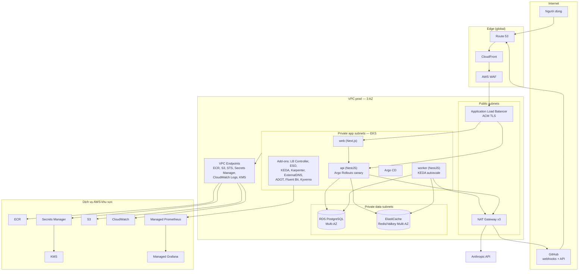

**Ánh xạ từ MVP sang production:**

| MVP (ADR-015) | Production (đề xuất) |
|---------------|----------------------|
| Nginx | CloudFront + WAF + ALB (AWS Load Balancer Controller) |
| Container `web`, `api`, `worker` | Deployment/Rollout trên EKS, cùng image như MVP |
| Container `migrate` | Kubernetes Job chạy như Argo CD PreSync hook |
| Container `postgres` | Amazon RDS for PostgreSQL 16, Multi-AZ (Aurora là bước sau) |
| Container `redis` (AOF) | Amazon ElastiCache for Redis OSS/Valkey, Multi-AZ, TLS + AUTH |
| `.env` + file `.pem` trên host | AWS Secrets Manager + External Secrets Operator → mount file |
| `docker compose up` | Argo CD đồng bộ từ Git |
| Log ra stdout | Fluent Bit → CloudWatch Logs; metric → Managed Prometheus |

**Không thay đổi trong ứng dụng:** vẫn là một image backend với hai entry point (`dist/main.js`, `dist/worker.js`), BullMQ trên Redis, Prisma migration. Việc chuyển lên EKS chủ yếu là việc của hạ tầng; các thay đổi code cần thiết liệt kê ở §15.

---

# 3. Tài khoản AWS và mạng

## 3.1 Mô hình đa tài khoản (AWS Organizations)

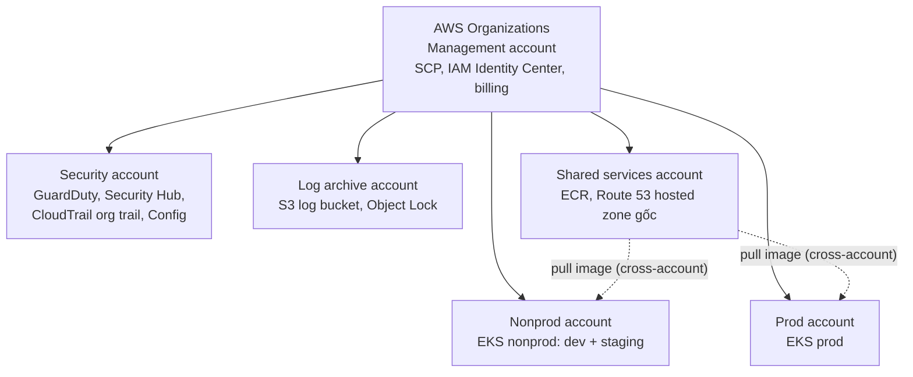

| Tài khoản | Chứa | Lý do tách |
|-----------|------|-----------|
| Management | Organizations, SCP, IAM Identity Center | Không chạy workload |
| Security | GuardDuty, Security Hub, Config aggregator | Người vận hành workload không tắt được giám sát |
| Log archive | CloudTrail và log bất biến | Chống xóa dấu vết |
| Shared services | ECR (một nơi build, nhiều nơi pull), DNS gốc | Build một lần, promote cùng một digest |
| Nonprod | Cluster `codelens-nonprod` với namespace `dev`, `staging` | Tiết kiệm; staging dùng cấu hình giống prod |
| Prod | Cluster `codelens-prod` | Ranh giới blast radius và IAM |

**SCP đề xuất:** chặn tắt CloudTrail/GuardDuty; chặn tạo IAM user có access key; giới hạn region; chặn xóa KMS key và RDS snapshot ở prod.

## 3.2 Thiết kế VPC (mỗi môi trường)

| Subnet | CIDR ví dụ (VPC `10.20.0.0/16`) | Chứa |
|--------|--------------------------------|------|
| Public × 3 AZ | `10.20.0.0/22`, `10.20.4.0/22`, `10.20.8.0/22` | ALB, NAT Gateway |
| Private app × 3 AZ | `10.20.32.0/19`, `10.20.64.0/19`, `10.20.96.0/19` | Node và pod EKS (VPC CNI cần nhiều IP) |
| Private data × 3 AZ | `10.20.128.0/24` … `10.20.130.0/24` | RDS, ElastiCache |

- **NAT Gateway mỗi AZ** ở prod (nonprod có thể dùng một để tiết kiệm). Egress cần cho: `api.github.com`, `github.com`, Anthropic API.
- **VPC endpoints** cho ECR (api, dkr), S3 (gateway), STS, Secrets Manager, KMS, CloudWatch Logs → giảm chi phí NAT và giữ lưu lượng nội bộ AWS trong VPC.
- 💡 Tùy chọn: **AWS Network Firewall** với allowlist tên miền cho egress (chỉ GitHub, Anthropic, AWS) → giảm rủi ro exfiltration nếu một pod bị chiếm.
- Security group: ALB → pod (qua target type `ip`); pod → RDS 5432, ElastiCache 6379 dùng **Security Groups for Pods** để chỉ `api`, `worker`, `migrate` được vào DB.

## 3.3 Edge: DNS, CDN, WAF

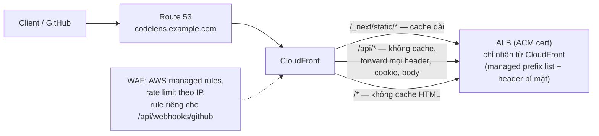

- Webhook: WAF **không** được chặn nhầm body lớn của GitHub; đặt ngoại lệ kích thước body cho `/api/webhooks/github`, xác thực thật vẫn là chữ ký HMAC (FR-028). Allowlist IP GitHub (lấy từ `https://api.github.com/meta`) là lớp phụ, không thay thế chữ ký.
- CloudFront phải chuyển tiếp nguyên vẹn các header `X-Hub-Signature-256`, `X-GitHub-Event`, `X-GitHub-Delivery` và **raw body** (không nén lại, không biến đổi).
- Giữ **cùng một origin** cho web và API như MVP (research R3), để cookie `SameSite=Lax` và CSRF hoạt động như cũ.

---

# 4. EKS cluster

## 4.1 Cấu hình cluster

| Hạng mục | Lựa chọn | Ghi chú |
|----------|---------|---------|
| Phiên bản | EKS bản mới nhất được hỗ trợ tiêu chuẩn | Nâng cấp mỗi quý, nonprod trước prod 2 tuần |
| Control plane endpoint | Private + public giới hạn CIDR (hoặc private hoàn toàn) | Argo CD chạy trong cluster nên không cần CI truy cập API server |
| Xác thực | EKS access entries + IAM Identity Center | Không dùng `aws-auth` ConfigMap |
| IAM cho pod | **EKS Pod Identity** | Mỗi ServiceAccount một IAM role tối thiểu |
| Mã hóa Secret | Envelope encryption với KMS CMK | |
| Log control plane | api, audit, authenticator → CloudWatch | |
| OS node | Bottlerocket (hoặc AL2023) | Bề mặt tấn công nhỏ, cập nhật nguyên khối |

## 4.2 Node pools

| Pool | Quản lý bởi | Instance | Dùng cho |
|------|------------|----------|---------|
| `system` | EKS managed node group, 3 node (1/AZ) | On-demand, Graviton (vd. `m7g.large`) | CoreDNS, Argo CD, Karpenter, controllers |
| `app` | **Karpenter** NodePool | On-demand, Graviton, đa kích thước | `api`, `web` (cần ổn định cho webhook) |
| `worker` | Karpenter NodePool | **Spot** + on-demand fallback, Graviton | `worker` (job có retry, BullMQ chịu được mất pod) |

- Image cần build **multi-arch** (`linux/amd64,linux/arm64`) để chạy trên Graviton; `node:22-alpine` hỗ trợ cả hai.
- Worker trên Spot an toàn vì: BullMQ trả job "stalled" về hàng đợi, sync/reconcile ghi trong một transaction, và worker đã xử lý `SIGTERM` (`backend/src/worker.ts`). Cần `terminationGracePeriodSeconds` đủ dài và Karpenter xử lý thông báo gián đoạn Spot (2 phút).

## 4.3 Add-on và controller

| Thành phần | Vai trò | Cài bằng |
|-----------|---------|---------|
| VPC CNI (bật Network Policy), CoreDNS, kube-proxy, EBS CSI, Pod Identity Agent | Nền tảng | EKS managed add-on (Terraform) |
| AWS Load Balancer Controller | Tạo ALB từ Ingress, hỗ trợ Argo Rollouts chia traffic | Argo CD |
| ExternalDNS | Tạo bản ghi Route 53 | Argo CD |
| Karpenter | Cấp node theo nhu cầu | Terraform (bootstrap) + Argo CD |
| External Secrets Operator | Đồng bộ Secrets Manager → Kubernetes Secret | Argo CD |
| KEDA | Autoscale worker theo độ dài hàng đợi BullMQ | Argo CD |
| Argo Rollouts | Canary + phân tích tự động cho `api` | Argo CD |
| Metrics Server | HPA theo CPU cho `web`, `api` | EKS add-on |
| ADOT Collector | Metric/trace → Managed Prometheus, X-Ray | Argo CD |
| Fluent Bit | Log → CloudWatch Logs | Argo CD |
| Kyverno | Chính sách admission: image ký số, non-root, không `:latest`, có resource limits | Argo CD |

## 4.4 Namespace

```text
codelens-nonprod                     codelens-prod
├── argocd                           ├── argocd
├── platform (ESO, KEDA, Rollouts…)  ├── platform
├── observability                    ├── observability
├── codelens-dev                     └── codelens
├── codelens-staging
└── codelens-e2e-<pr> (tạm thời)
```

---

# 5. Dịch vụ dữ liệu và bảo mật AWS

## 5.1 PostgreSQL — Amazon RDS

| Thuộc tính | Prod | Nonprod |
|-----------|------|---------|
| Engine | PostgreSQL 16 (khớp MVP) | như prod |
| Triển khai | **Multi-AZ DB cluster** (1 writer + 2 standby đọc được) hoặc Multi-AZ instance | Single-AZ |
| Instance | Graviton (vd. `db.r7g.large`), điều chỉnh theo đo đạc | `db.t4g.medium` |
| Lưu trữ | gp3, autoscaling, mã hóa KMS CMK | như prod |
| Backup | Tự động 14–35 ngày, PITR; snapshot copy sang region DR | 7 ngày |
| Kết nối | TLS bắt buộc (`rds.force_ssl=1`); `sslmode=verify-full` trong `DATABASE_URL` | như prod |
| Xác thực | Mật khẩu do **Secrets Manager quản lý và tự xoay vòng** | như prod |
| Pooling | 💡 RDS Proxy hoặc PgBouncer khi số pod lớn | Không cần |
| Giám sát | Performance Insights, Enhanced Monitoring | Tối thiểu |

**Lưu ý về pooling và advisory lock:** sync và reconcile dùng `pg_advisory_xact_lock` **bên trong transaction**, nên tương thích transaction pooling của PgBouncer. Với RDS Proxy, một số câu lệnh gây *session pinning* làm giảm hiệu quả pooling — cần đo trên staging trước khi chọn giữa RDS Proxy và PgBouncer.

**Aurora PostgreSQL** là bước sau khi cần read replica nhiều, failover nhanh hơn, hoặc storage lớn (Stage 3).

## 5.2 Redis — Amazon ElastiCache

| Thuộc tính | Giá trị | Lý do |
|-----------|---------|------|
| Engine | Redis OSS 7 hoặc Valkey (tương thích giao thức) | BullMQ và ioredis chạy được với cả hai |
| Topology | Replication group, **cluster mode tắt**, 1 primary + 2 replica, Multi-AZ, auto failover | BullMQ dùng nhiều key trong một script Lua; cluster mode đòi hỏi hash tag cho prefix queue |
| `maxmemory-policy` | **`noeviction`** | BullMQ yêu cầu; bị evict key là mất job |
| Bảo mật | TLS in-transit (`rediss://`), AUTH/RBAC user, mã hóa at-rest | |
| Persistence | Snapshot hằng ngày | Thay AOF của MVP |

💡 Khi tải lớn: tách **hai** replication group — một cho **session** (đọc nhiều, nhỏ) và một cho **hàng đợi BullMQ** (ghi nhiều) — để bão hàng đợi không làm chậm đăng nhập.

## 5.3 Bí mật: Secrets Manager + External Secrets Operator

Ứng dụng đã đọc bí mật từ `<NAME>` hoặc file `<NAME>_FILE` (`backend/src/config/secret-provider.ts`). Vì vậy **không cần sửa code**: ESO đồng bộ từ Secrets Manager thành Kubernetes Secret, pod mount thành file read-only.

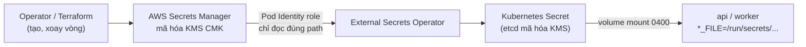

| Bí mật | Path Secrets Manager (ví dụ) | Ai được đọc |
|--------|------------------------------|-------------|
| GitHub App private key | `codelens/prod/github-app/private-key` | ESO của namespace `codelens` |
| Webhook secret | `codelens/prod/github-app/webhook-secret` | như trên |
| Client secret | `codelens/prod/github-app/client-secret` | như trên |
| Session secret | `codelens/prod/session-secret` | như trên |
| DB credentials (RDS quản lý) | `rds!db-…` | như trên |
| Redis AUTH | `codelens/prod/redis-auth` | như trên |
| 🧭 BYOK master key | KMS CMK riêng, không phải secret | Chỉ role của `worker` (Encrypt/Decrypt) |

```yaml
# Mẫu ExternalSecret
apiVersion: external-secrets.io/v1beta1
kind: ExternalSecret
metadata:
  name: codelens-github-app
  namespace: codelens
spec:
  refreshInterval: 1h
  secretStoreRef:
    kind: SecretStore
    name: aws-secrets-manager
  target:
    name: codelens-github-app
    creationPolicy: Owner
  data:
    - secretKey: github_app_private_key.pem
      remoteRef: { key: codelens/prod/github-app/private-key }
    - secretKey: webhook_secret
      remoteRef: { key: codelens/prod/github-app/webhook-secret }
    - secretKey: client_secret
      remoteRef: { key: codelens/prod/github-app/client-secret }
    - secretKey: session_secret
      remoteRef: { key: codelens/prod/session-secret }
```

**Mỗi môi trường một GitHub App riêng** (`codelens-dev`, `codelens-staging`, `codelens`), mỗi app có private key, webhook secret và webhook URL riêng. Không bao giờ dùng key của prod ở nonprod.

## 5.4 Các dịch vụ khác

| Dịch vụ | Dùng cho |
|---------|---------|
| **ECR** (shared account) | Image, Helm chart OCI; scan on push; tag **immutable**; lifecycle policy xóa image cũ không dùng |
| **S3** | Backup, artifact lớn của review (diff, context — 🧭), log archive; Block Public Access, SSE-KMS, versioning |
| **KMS** | CMK riêng cho: RDS, ElastiCache, Secrets Manager, EKS secrets, S3, BYOK |
| **ACM** | Chứng chỉ TLS cho ALB và CloudFront |
| **CloudTrail, GuardDuty (bật EKS Protection), Security Hub, AWS Config** | Giám sát và tuân thủ |
| **AWS Backup** | Chính sách backup tập trung, copy cross-region |
| 💡 **SQS** | Chỉ khi tách phần ingest webhook khỏi Redis ở Stage 3; hiện tại giữ BullMQ để không đổi code |

## 5.5 Hạ tầng dưới dạng code (Terraform)

```text
codelens-infra/
├── modules/
│   ├── network/          # VPC, subnet, NAT, endpoints
│   ├── eks/              # cluster, managed node group, add-ons, access entries
│   ├── karpenter/        # IAM, SQS interruption queue
│   ├── rds/              # PostgreSQL, parameter group, secret managed
│   ├── elasticache/
│   ├── edge/             # CloudFront, WAF, ACM, Route 53
│   ├── ecr/
│   ├── iam-pod-identity/ # role cho từng ServiceAccount
│   └── argocd-bootstrap/ # cài Argo CD + root Application (một lần)
├── envs/
│   ├── shared/
│   ├── nonprod/
│   └── prod/
└── .github/workflows/terraform.yml   # plan trên PR, apply sau khi duyệt
```

- State ở S3 (versioning, SSE-KMS) với khóa trạng thái bằng DynamoDB hoặc S3 native locking.
- Ranh giới trách nhiệm: **Terraform** tạo mọi thứ ngoài cluster và bootstrap Argo CD; **Argo CD** quản lý mọi thứ bên trong cluster. Không chồng chéo.

---

# 6. Workload CodeLens trên Kubernetes

## 6.1 Tổng quan workload

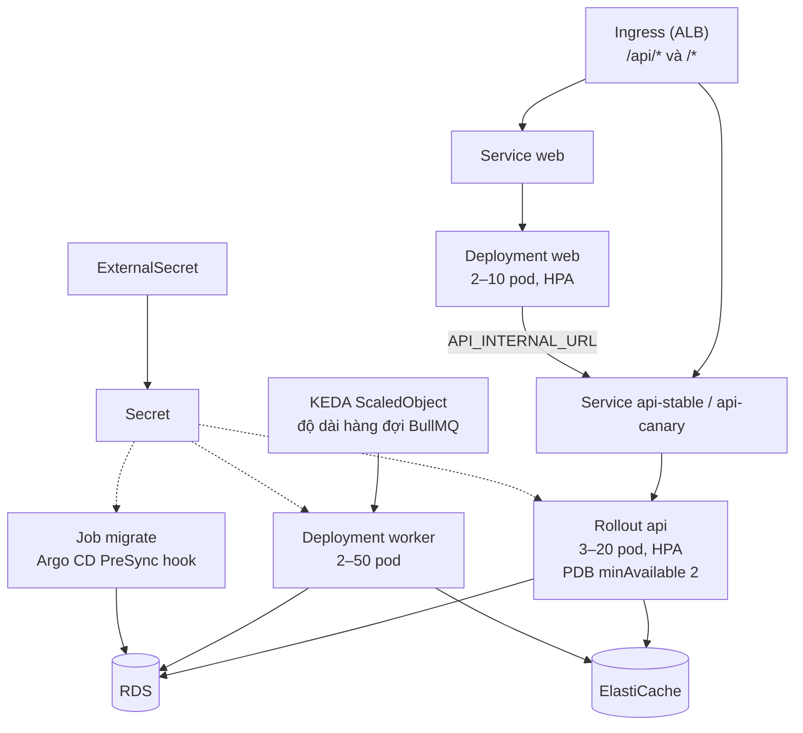

| Workload | Kiểu | Image / lệnh | Replica | Scale theo |
|----------|------|-------------|---------|-----------|
| `api` | Argo **Rollout** (canary) | backend `runtime`, `node dist/main.js` | 3–20 | CPU + số request (HPA) |
| `worker` | Deployment | backend `runtime`, `node dist/worker.js` | 2–50 | Độ dài hàng đợi (KEDA) |
| `web` | Deployment | frontend `runtime` | 2–10 | CPU (HPA) |
| `migrate` | Job (PreSync hook) | backend, `prisma migrate deploy` | 1 | — |

## 6.2 Mẫu Helm values (prod)

```yaml
# envs/prod/values.yaml (trong repo GitOps)
global:
  environment: prod
  publicBaseUrl: https://codelens.example.com
  image:
    registry: 111111111111.dkr.ecr.ap-southeast-1.amazonaws.com
    backend:
      repository: codelens/backend
      digest: sha256:REPLACED_BY_CI          # luôn deploy theo digest, không theo tag
    frontend:
      repository: codelens/frontend
      digest: sha256:REPLACED_BY_CI
  appVersion: 1.4.0                           # chỉ để hiển thị/nhãn

config:                                       # không chứa bí mật
  GITHUB_APP_ID: "123456"
  GITHUB_APP_CLIENT_ID: Iv1.xxxxxxxx
  GITHUB_APP_SLUG: codelens
  LOG_LEVEL: info
  QUEUE_BACKOFF_MS: "5000"

secrets:
  externalSecretName: codelens-github-app    # file mount tại /run/secrets
  databaseSecretName: codelens-db            # dựng DATABASE_URL từ secret RDS
  redisSecretName: codelens-redis

api:
  replicas: { min: 3, max: 20 }
  resources:
    requests: { cpu: 250m, memory: 384Mi }
    limits:   { memory: 768Mi }
  pdb: { minAvailable: 2 }
  rollout:
    canarySteps: [5, 25, 50, 100]
    pauseMinutes: 5

worker:
  replicas: { min: 2, max: 50 }
  terminationGracePeriodSeconds: 120
  resources:
    requests: { cpu: 250m, memory: 512Mi }
    limits:   { memory: 1Gi }
  keda:
    queues:
      - name: reconcile-installation
        targetLength: "20"
      - name: sync-repositories
        targetLength: "20"
  nodePool: worker                            # Spot

web:
  replicas: { min: 2, max: 10 }

podSecurity:
  runAsNonRoot: true
  readOnlyRootFilesystem: true
  allowPrivilegeEscalation: false
  seccompProfile: RuntimeDefault
```

## 6.3 Probe, shutdown và phân bổ

- **Probe** (cần thêm endpoint, xem §15): `livenessProbe` → `/api/health/live` (tiến trình còn sống), `readinessProbe` → `/api/health/ready` (kết nối được DB và Redis). Worker không nhận traffic nên chỉ cần liveness.
- **Shutdown an toàn cho webhook:** `preStop: sleep 15` để ALB rút pod khỏi target group trước khi tiến trình dừng; ALB deregistration delay 30 s. Tránh GitHub nhận lỗi 5xx trong lúc rollout.
- **Worker:** `terminationGracePeriodSeconds: 120` để job đang chạy kết thúc; job chưa xong sẽ bị BullMQ đánh dấu stalled và chạy lại — an toàn vì mọi handler idempotent (system-design §6.1).
- **Phân bổ:** `topologySpreadConstraints` theo `topology.kubernetes.io/zone` cho `api`, `web`, `worker`; PDB cho cả ba.

## 6.4 KEDA cho worker

BullMQ lưu job đang chờ trong Redis list `bull:<queue>:wait`, nên có thể dùng scaler `redis` của KEDA:

```yaml
apiVersion: keda.sh/v1alpha1
kind: ScaledObject
metadata:
  name: worker
  namespace: codelens
spec:
  scaleTargetRef: { name: worker }
  minReplicaCount: 2
  maxReplicaCount: 50
  cooldownPeriod: 300
  triggers:
    - type: redis
      metadata:
        address: master.codelens-prod.xxxxxx.cache.amazonaws.com:6379
        listName: bull:reconcile-installation:wait
        listLength: "20"
        enableTLS: "true"
      authenticationRef: { name: keda-redis-auth }
    - type: redis
      metadata:
        address: master.codelens-prod.xxxxxx.cache.amazonaws.com:6379
        listName: bull:sync-repositories:wait
        listLength: "20"
        enableTLS: "true"
      authenticationRef: { name: keda-redis-auth }
```

🧭 Khi có review AI: thêm queue `review` và `publish` với trigger riêng; `listLength` cho review nên nhỏ (vd. 5) vì mỗi job chạy lâu. Giới hạn trên của `maxReplicaCount` phải khớp với rate limit của LLM provider (system-design §6.8), nếu không scale thêm chỉ tạo thêm lỗi 429.

## 6.5 NetworkPolicy

```yaml
# Mặc định chặn hết trong namespace, rồi mở từng luồng cần thiết
apiVersion: networking.k8s.io/v1
kind: NetworkPolicy
metadata: { name: default-deny, namespace: codelens }
spec:
  podSelector: {}
  policyTypes: [Ingress, Egress]
---
apiVersion: networking.k8s.io/v1
kind: NetworkPolicy
metadata: { name: api-ingress, namespace: codelens }
spec:
  podSelector: { matchLabels: { app.kubernetes.io/name: api } }
  policyTypes: [Ingress]
  ingress:
    - from:
        - ipBlock: { cidr: 10.20.0.0/20 }        # public subnets chứa ALB
        - podSelector: { matchLabels: { app.kubernetes.io/name: web } }
      ports: [{ port: 3000 }]
```

Egress: cho phép DNS (CoreDNS), subnet data (5432, 6379), VPC endpoints và 443 ra Internet (GitHub, Anthropic). `web` chỉ được gọi `api`, không được ra Internet hay vào DB.

---

# 7. Cấu trúc repository

Đề xuất **ba repository** để tách quyền:

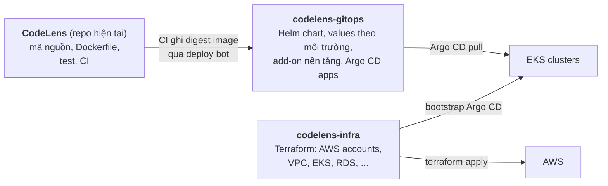

| Repo | Ai được merge | Tại sao tách |
|------|--------------|-------------|
| `CodeLens` | Developer (review theo CODEOWNERS) | Developer không cần quyền deploy prod |
| `codelens-gitops` | Nhánh `main`: deploy bot cho dev/staging; **prod cần duyệt** của platform owner | Mọi thay đổi trạng thái cluster là một commit có người duyệt |
| `codelens-infra` | Platform team | Thay đổi hạ tầng có blast radius lớn nhất |

**Cấu trúc `codelens-gitops`:**

```text
codelens-gitops/
├── charts/
│   └── codelens/                 # Helm chart của ứng dụng
│       ├── Chart.yaml
│       ├── values.yaml           # mặc định an toàn
│       └── templates/
│           ├── api-rollout.yaml
│           ├── api-services.yaml
│           ├── api-analysis.yaml
│           ├── worker-deployment.yaml
│           ├── worker-scaledobject.yaml
│           ├── web-deployment.yaml
│           ├── ingress.yaml
│           ├── migrate-job.yaml  # PreSync hook
│           ├── externalsecrets.yaml
│           ├── networkpolicies.yaml
│           ├── pdb.yaml
│           └── serviceaccounts.yaml
├── envs/
│   ├── dev/values.yaml           # CI tự cập nhật digest
│   ├── staging/values.yaml       # promote tự động sau khi dev đạt
│   └── prod/values.yaml          # promote bằng PR có duyệt
├── platform/                     # add-on theo cluster
│   ├── base/                     # ESO, KEDA, Rollouts, LB controller, Kyverno, ...
│   ├── nonprod/
│   └── prod/
└── clusters/
    ├── nonprod/
    │   ├── root-app.yaml         # app-of-apps
    │   ├── projects.yaml         # AppProject
    │   └── applicationset.yaml   # codelens-dev, codelens-staging
    └── prod/
        ├── root-app.yaml
        ├── projects.yaml
        └── codelens.yaml
```

---

# 8. Argo CD và GitOps

## 8.1 Mô hình triển khai Argo CD

**Mỗi cluster một Argo CD, kéo (pull) từ Git.** Không dùng một Argo CD trung tâm điều khiển cluster prod từ xa.

| Phương án | Ưu | Nhược | Chọn |
|-----------|----|-------|------|
| Argo CD trong từng cluster | Không cần credential cross-account vào API server prod; prod tự chủ | Hai bản Argo CD để vận hành | ✅ |
| Một Argo CD hub quản lý nhiều cluster | Một giao diện | Hub bị chiếm = mọi cluster bị chiếm | ✘ |

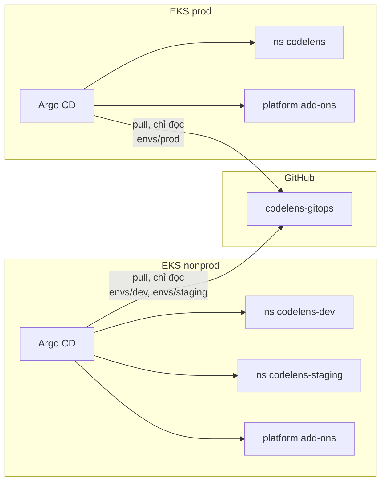

## 8.2 Cấu hình Argo CD

- **Đăng nhập:** SSO qua GitHub (Dex) hoặc IAM Identity Center (OIDC); tắt tài khoản `admin` sau bootstrap.
- **RBAC:** developer chỉ xem ở prod; platform owner được sync/rollback. Mọi thay đổi vẫn đi qua Git; UI không dùng để sửa manifest.
- **Truy cập repo:** Argo CD đọc `codelens-gitops` bằng GitHub App **chỉ đọc** hoặc deploy key read-only.
- **Webhook Git → Argo CD** để sync nhanh (thay vì chờ poll 3 phút).
- **Thông báo:** Argo CD Notifications → Slack khi sync lỗi, health degraded, rollout bị hủy.

## 8.3 AppProject và ApplicationSet

```yaml
# clusters/prod/projects.yaml
apiVersion: argoproj.io/v1alpha1
kind: AppProject
metadata:
  name: codelens
  namespace: argocd
spec:
  description: Ứng dụng CodeLens (prod)
  sourceRepos:
    - https://github.com/<org>/codelens-gitops.git
  destinations:
    - server: https://kubernetes.default.svc
      namespace: codelens
  clusterResourceWhitelist: []          # ứng dụng không được tạo tài nguyên cấp cluster
  namespaceResourceBlacklist:
    - group: ""
      kind: ResourceQuota
  roles:
    - name: deployer
      policies:
        - p, proj:codelens:deployer, applications, sync, codelens/*, allow
      groups: [codelens-platform-owners]
  syncWindows:
    - kind: deny                        # không deploy prod ngoài giờ làm việc (trừ khi override)
      schedule: "0 18 * * *"
      duration: 14h
      applications: ["*"]
      manualSync: true
```

```yaml
# clusters/nonprod/applicationset.yaml
apiVersion: argoproj.io/v1alpha1
kind: ApplicationSet
metadata:
  name: codelens-nonprod
  namespace: argocd
spec:
  goTemplate: true
  generators:
    - list:
        elements:
          - env: dev
          - env: staging
  template:
    metadata:
      name: "codelens-{{.env}}"
    spec:
      project: codelens-nonprod
      source:
        repoURL: https://github.com/<org>/codelens-gitops.git
        targetRevision: main
        path: charts/codelens
        helm:
          valueFiles:
            - "../../envs/{{.env}}/values.yaml"
      destination:
        server: https://kubernetes.default.svc
        namespace: "codelens-{{.env}}"
      syncPolicy:
        automated: { prune: true, selfHeal: true }
        syncOptions: [CreateNamespace=false, ServerSideApply=true]
        retry:
          limit: 3
          backoff: { duration: 30s, factor: 2, maxDuration: 5m }
```

```yaml
# clusters/prod/codelens.yaml
apiVersion: argoproj.io/v1alpha1
kind: Application
metadata:
  name: codelens-prod
  namespace: argocd
  annotations:
    notifications.argoproj.io/subscribe.on-sync-failed.slack: codelens-deploys
    notifications.argoproj.io/subscribe.on-health-degraded.slack: codelens-deploys
spec:
  project: codelens
  source:
    repoURL: https://github.com/<org>/codelens-gitops.git
    targetRevision: main
    path: charts/codelens
    helm:
      valueFiles: [../../envs/prod/values.yaml]
  destination:
    server: https://kubernetes.default.svc
    namespace: codelens
  syncPolicy:
    automated:
      prune: false          # prod: không tự xóa tài nguyên; xóa phải có người xác nhận
      selfHeal: true        # sửa tay trên cluster sẽ bị đưa về trạng thái trong Git
    syncOptions: [ServerSideApply=true]
```

**Tự động sync ở prod?** Có — nhưng chỉ sau khi PR vào `envs/prod/` được duyệt. "Nút bấm deploy" là **nút merge PR**, nên mọi lần deploy prod đều có người duyệt, lý do, và lịch sử trong Git. Canary (§10.2) là lớp bảo vệ thứ hai.

## 8.4 Thứ tự đồng bộ (sync waves)

| Wave | Tài nguyên |
|------|-----------|
| -2 | ServiceAccount, ExternalSecret (chờ Secret sẵn sàng) |
| -1 | **Job `migrate`** (PreSync hook) |
| 0 | ConfigMap, Service |
| 1 | `worker` Deployment, ScaledObject |
| 2 | `api` Rollout, `web` Deployment |
| 3 | Ingress |

```yaml
# templates/migrate-job.yaml (rút gọn)
apiVersion: batch/v1
kind: Job
metadata:
  name: codelens-migrate
  annotations:
    argocd.argoproj.io/hook: PreSync
    argocd.argoproj.io/hook-delete-policy: BeforeHookCreation
spec:
  backoffLimit: 0                 # migration lỗi thì dừng deploy, không thử lại mù quáng
  activeDeadlineSeconds: 900
  template:
    spec:
      restartPolicy: Never
      serviceAccountName: codelens-migrate
      containers:
        - name: migrate
          image: "{{ .Values.global.image.registry }}/{{ .Values.global.image.backend.repository }}@{{ .Values.global.image.backend.digest }}"
          command: ["pnpm", "exec", "prisma", "migrate", "deploy"]
          envFrom: [{ secretRef: { name: codelens-db-url } }]
```

Nếu Job migrate thất bại, Argo CD **dừng sync** và phiên bản cũ tiếp tục chạy.

---

# 9. CI/CD workflow

## 9.1 Tổng quan pipeline

```mermaid
flowchart LR
    subgraph CI["CI — GitHub Actions (repo CodeLens)"]
        PR["Pull request"] --> V["Verify<br/>lint, build, unit,<br/>contract, integration"]
        V --> SEC["Security<br/>gitleaks, CodeQL/Semgrep,<br/>dependency review"]
        SEC --> IMG["Build image (không push)<br/>Trivy scan"]
        IMG --> E2E["E2E trên kind/compose<br/>fake GitHub + Playwright"]
        E2E --> MERGE["Merge vào main"]
        MERGE --> BUILD["Build multi-arch<br/>push ECR theo digest<br/>SBOM + cosign sign"]
    end
    subgraph CD["CD — GitOps"]
        BUILD --> BDEV["Bot commit digest<br/>envs/dev"]
        BDEV --> ADEV["Argo CD sync dev"]
        ADEV --> SMOKE["Smoke test dev"]
        SMOKE --> PSTG["Bot commit<br/>envs/staging"]
        PSTG --> ASTG["Argo CD sync staging"]
        ASTG --> REG["Regression + load test"]
        REG --> TAG["Tag release vX.Y.Z"]
        TAG --> PPRD["Bot mở PR<br/>envs/prod"]
        PPRD --> APPR{"Duyệt<br/>(CODEOWNERS)"}
        APPR --> APRD["Argo CD sync prod"]
        APRD --> CAN["Argo Rollouts canary<br/>5% → 25% → 50% → 100%<br/>+ AnalysisRun"]
    end
    CAN -->|"Chỉ số xấu"| RB["Tự động abort<br/>về phiên bản cũ"]
```

## 9.2 Chiến lược nhánh và phiên bản

| Hạng mục | Quy ước |
|----------|--------|
| Mô hình | Trunk-based: nhánh ngắn → PR → `main` |
| Nhánh feature | `NNN-ten-feature` (khớp Spec Kit, vd. `001-github-app-onboarding`) |
| Bảo vệ `main` | PR bắt buộc, ≥ 1 approve, CODEOWNERS, mọi check xanh, linear history, cấm force-push |
| Phiên bản | SemVer; tag `vX.Y.Z` trên `main` tạo release |
| Định danh image | **Digest** (`sha256:…`) là định danh deploy; tag phụ: `sha-<git-sha>`, `vX.Y.Z` |
| Build một lần | Cùng một digest đi qua dev → staging → prod; không build lại cho từng môi trường |
| Config theo môi trường | Chỉ nằm ở `envs/<env>/values.yaml`, không nằm trong image |

## 9.3 Xác thực trong CI: không có credential sống lâu

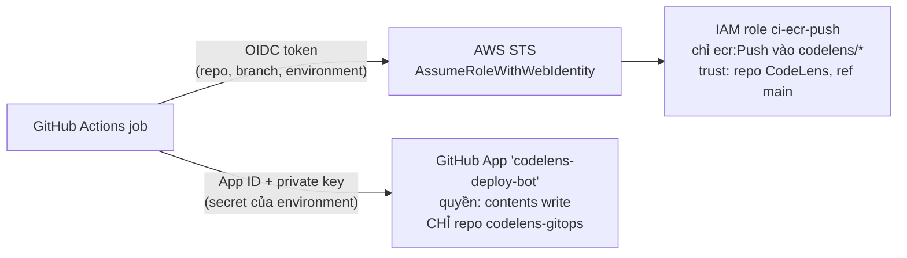

- **Không** lưu AWS access key trong GitHub Secrets. Trust policy của role chỉ chấp nhận `repo:<org>/CodeLens:ref:refs/heads/main` (và tag release).
- **Deploy bot là một GitHub App riêng**, cài chỉ trên `codelens-gitops`. Nó **không liên quan** tới GitHub App sản phẩm CodeLens — app sản phẩm vẫn chỉ đọc (Principle II, FR-032).
- `permissions:` của mỗi workflow đặt tối thiểu (mặc định `contents: read`).

## 9.4 Workflow PR — `ci.yml` (mở rộng từ CI hiện có)

CI hiện tại (`.github/workflows/ci.yml`, `secret-scan.yml`) đã chạy lint, build, unit, contract, integration và quét bí mật. Đề xuất bổ sung các job sau:

```yaml
name: ci
on:
  pull_request:
  push:
    branches: [main]

permissions:
  contents: read

concurrency:
  group: ci-${{ github.ref }}
  cancel-in-progress: true

jobs:
  verify:                       # giữ nguyên như hiện tại
    runs-on: ubuntu-latest
    steps:
      - uses: actions/checkout@v4
      - uses: pnpm/action-setup@v4
      - uses: actions/setup-node@v4
        with: { node-version-file: .nvmrc, cache: pnpm }
      - run: pnpm install --frozen-lockfile
      - run: pnpm -r lint
      - run: pnpm -r build
      - run: pnpm -r test:unit
      - run: pnpm --filter @codelens/backend test:contract
      - run: pnpm --filter @codelens/backend test:integration

  sast:
    runs-on: ubuntu-latest
    permissions: { contents: read, security-events: write }
    steps:
      - uses: actions/checkout@v4
      - uses: github/codeql-action/init@v3
        with: { languages: javascript-typescript }
      - uses: github/codeql-action/analyze@v3

  dependency-review:
    if: github.event_name == 'pull_request'
    runs-on: ubuntu-latest
    steps:
      - uses: actions/checkout@v4
      - uses: actions/dependency-review-action@v4
        with: { fail-on-severity: high }

  image-scan:
    runs-on: ubuntu-latest
    strategy:
      matrix:
        include:
          - { name: backend,  dockerfile: backend/Dockerfile,  target: runtime }
          - { name: frontend, dockerfile: frontend/Dockerfile, target: runtime }
    steps:
      - uses: actions/checkout@v4
      - uses: docker/setup-buildx-action@v3
      - uses: docker/build-push-action@v6
        with:
          context: .
          file: ${{ matrix.dockerfile }}
          target: ${{ matrix.target }}
          load: true
          tags: codelens/${{ matrix.name }}:ci
          cache-from: type=gha,scope=${{ matrix.name }}
          cache-to: type=gha,mode=max,scope=${{ matrix.name }}
      - uses: aquasecurity/trivy-action@0.28.0
        with:
          image-ref: codelens/${{ matrix.name }}:ci
          scanners: vuln,secret
          severity: CRITICAL,HIGH
          ignore-unfixed: true
          exit-code: "1"

  e2e:
    needs: [verify]
    runs-on: ubuntu-latest
    steps:
      - uses: actions/checkout@v4
      # Toàn bộ stack với profile test: Postgres, Redis, fake GitHub, API, worker, web.
      # Không gọi GitHub thật, không gọi LLM thật (Principle XII).
      - run: docker compose -f deploy/docker-compose.yml --profile test up -d --build --wait
      - run: pnpm --filter @codelens/frontend exec playwright test
```

Trong repo `codelens-gitops`, workflow PR riêng chạy `helm lint`, `helm template | kubeconform -strict`, `kyverno test` (kiểm tra chính sách trước khi merge) và in **diff manifest** (vd. `argocd app diff` hoặc `helm diff`) vào comment PR để người duyệt thấy chính xác thứ gì sẽ thay đổi.

## 9.5 Workflow build và deploy dev — `release.yml`

```yaml
name: build-and-deploy-dev
on:
  push:
    branches: [main]

permissions:
  contents: read
  id-token: write               # OIDC tới AWS và keyless signing

concurrency:
  group: deploy-dev
  cancel-in-progress: false

jobs:
  build:
    runs-on: ubuntu-latest
    environment: build
    outputs:
      backend_digest: ${{ steps.backend.outputs.digest }}
      frontend_digest: ${{ steps.frontend.outputs.digest }}
    steps:
      - uses: actions/checkout@v4
      - uses: aws-actions/configure-aws-credentials@v4
        with:
          role-to-assume: arn:aws:iam::111111111111:role/ci-ecr-push
          aws-region: ap-southeast-1
      - id: ecr
        uses: aws-actions/amazon-ecr-login@v2
      - uses: docker/setup-qemu-action@v3
      - uses: docker/setup-buildx-action@v3

      - id: backend
        uses: docker/build-push-action@v6
        with:
          context: .
          file: backend/Dockerfile
          target: runtime
          platforms: linux/amd64,linux/arm64
          push: true
          provenance: mode=max
          sbom: true
          tags: ${{ steps.ecr.outputs.registry }}/codelens/backend:sha-${{ github.sha }}

      - id: frontend
        uses: docker/build-push-action@v6
        with:
          context: .
          file: frontend/Dockerfile
          target: runtime
          platforms: linux/amd64,linux/arm64
          push: true
          provenance: mode=max
          sbom: true
          tags: ${{ steps.ecr.outputs.registry }}/codelens/frontend:sha-${{ github.sha }}

      - uses: sigstore/cosign-installer@v3
      - name: Ký image theo digest (keyless, gắn với danh tính workflow)
        run: |
          cosign sign --yes "${{ steps.ecr.outputs.registry }}/codelens/backend@${{ steps.backend.outputs.digest }}"
          cosign sign --yes "${{ steps.ecr.outputs.registry }}/codelens/frontend@${{ steps.frontend.outputs.digest }}"

  deploy-dev:
    needs: build
    runs-on: ubuntu-latest
    environment: dev
    steps:
      - id: bot
        uses: actions/create-github-app-token@v1
        with:
          app-id: ${{ vars.DEPLOY_BOT_APP_ID }}
          private-key: ${{ secrets.DEPLOY_BOT_PRIVATE_KEY }}
          owner: ${{ github.repository_owner }}
          repositories: codelens-gitops
      - uses: actions/checkout@v4
        with:
          repository: ${{ github.repository_owner }}/codelens-gitops
          token: ${{ steps.bot.outputs.token }}
      - name: Cập nhật digest cho dev
        env:
          BACKEND: ${{ needs.build.outputs.backend_digest }}
          FRONTEND: ${{ needs.build.outputs.frontend_digest }}
        run: |
          yq -i '.global.image.backend.digest = strenv(BACKEND) |
                 .global.image.frontend.digest = strenv(FRONTEND) |
                 .global.gitSha = "${{ github.sha }}"' envs/dev/values.yaml
          git config user.name "codelens-deploy-bot[bot]"
          git config user.email "deploy-bot@users.noreply.github.com"
          git commit -am "deploy(dev): CodeLens ${{ github.sha }}"
          git push
```

Chỉ có **một** job (`deploy-dev`) được ghi vào `envs/dev/`. Staging và prod đi qua bước promote ở §9.6.

## 9.6 Promote staging và prod — `promote.yml`

```yaml
name: promote
on:
  workflow_dispatch:
    inputs:
      target: { type: choice, options: [staging, prod], required: true }
  release:
    types: [published]          # tag vX.Y.Z → mở PR prod

permissions:
  contents: read

jobs:
  promote:
    runs-on: ubuntu-latest
    environment: ${{ github.event_name == 'release' && 'prod' || inputs.target }}
    steps:
      - id: bot
        uses: actions/create-github-app-token@v1
        with:
          app-id: ${{ vars.DEPLOY_BOT_APP_ID }}
          private-key: ${{ secrets.DEPLOY_BOT_PRIVATE_KEY }}
          owner: ${{ github.repository_owner }}
          repositories: codelens-gitops
      - uses: actions/checkout@v4
        with:
          repository: ${{ github.repository_owner }}/codelens-gitops
          token: ${{ steps.bot.outputs.token }}
      - name: Sao chép digest từ môi trường nguồn
        run: |
          TARGET="${{ github.event_name == 'release' && 'prod' || inputs.target }}"
          SOURCE=$([ "$TARGET" = prod ] && echo staging || echo dev)
          yq -i ".global.image = load(\"envs/$SOURCE/values.yaml\").global.image" "envs/$TARGET/values.yaml"
          echo "TARGET=$TARGET" >> "$GITHUB_ENV"
      - name: Staging commit thẳng, prod mở PR chờ duyệt
        env: { GH_TOKEN: "${{ steps.bot.outputs.token }}" }
        run: |
          git config user.name "codelens-deploy-bot[bot]"
          git config user.email "deploy-bot@users.noreply.github.com"
          if [ "$TARGET" = staging ]; then
            git commit -am "deploy(staging): promote from dev" && git push
          else
            BR="promote/prod-${{ github.run_id }}"
            git switch -c "$BR"
            git commit -am "deploy(prod): ${{ github.event.release.tag_name }}"
            git push -u origin "$BR"
            gh pr create --title "deploy(prod): ${{ github.event.release.tag_name }}" \
              --body "Promote digest đã qua staging. Xem diff manifest và kết quả regression trước khi duyệt."
          fi
```

**Cổng kiểm soát cho prod:**

| Cổng | Cơ chế |
|------|--------|
| Chỉ digest đã chạy ở staging mới lên prod | Workflow chỉ sao chép từ `envs/staging` |
| Có người duyệt | Branch protection + CODEOWNERS của `envs/prod/**` (platform owner) |
| Image hợp lệ | Kyverno trong cluster chỉ nhận image **được ký** bởi workflow `build-and-deploy-dev` của repo CodeLens |
| Không deploy ngoài giờ | Sync window của AppProject prod |
| Không gặp lỗi đã biết | Canary + AnalysisRun (§10.2) |

## 9.7 Môi trường kiểm thử theo PR (tùy chọn)

💡 Argo CD **ApplicationSet với Pull Request generator** tạo namespace `codelens-e2e-<pr>` trong cluster nonprod cho PR có label `preview`, dùng **fake GitHub** (image target `fake-github` đã có trong `backend/Dockerfile`) và Postgres/Redis trong pod. Namespace tự xóa khi PR đóng. Không dùng GitHub App thật cho môi trường preview.

## 9.8 Kiểm thử theo từng môi trường

| Môi trường | Kiểm thử | Gọi GitHub thật? |
|-----------|---------|-----------------|
| CI (PR) | Unit, contract, integration, E2E Playwright | **Không** — fake GitHub (CLAUDE.md, Principle XII) |
| Preview | E2E trên Kubernetes | **Không** |
| Dev | Smoke: `/api/health/ready`, trang đăng nhập tải được | Có, qua GitHub App `codelens-dev` và org thử nghiệm |
| Staging | Regression tự động + kiểm thử tải (k6) với webhook ký bằng secret staging | Có, app `codelens-staging` |
| Prod | Synthetic check (CloudWatch Synthetics) cho trang chủ và health | Không gửi webhook giả vào prod |

---

# 10. Chiến lược release, migration và rollback

## 10.1 Luồng một lần release

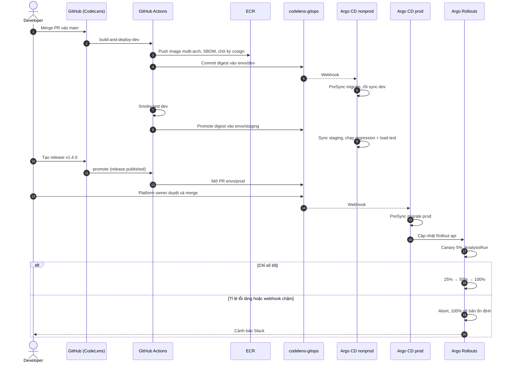

## 10.2 Canary cho `api` với Argo Rollouts

```yaml
apiVersion: argoproj.io/v1alpha1
kind: Rollout
metadata: { name: api, namespace: codelens }
spec:
  replicas: 3
  strategy:
    canary:
      canaryService: api-canary
      stableService: api-stable
      trafficRouting:
        alb:
          ingress: codelens
          servicePort: 3000
      analysis:
        templates: [{ templateName: api-health }]
        startingStep: 1
      steps:
        - setWeight: 5
        - pause: { duration: 5m }
        - setWeight: 25
        - pause: { duration: 5m }
        - setWeight: 50
        - pause: { duration: 10m }
---
apiVersion: argoproj.io/v1alpha1
kind: AnalysisTemplate
metadata: { name: api-health, namespace: codelens }
spec:
  metrics:
    - name: error-rate
      interval: 1m
      failureLimit: 2
      successCondition: result[0] < 0.01
      provider:
        prometheus:
          address: http://amp-proxy.observability:8005/workspaces/ws-xxxx
          query: |
            sum(rate(http_requests_total{app="api",version="canary",status=~"5.."}[2m]))
            / sum(rate(http_requests_total{app="api",version="canary"}[2m]))
    - name: webhook-latency-p95
      interval: 1m
      failureLimit: 2
      successCondition: result[0] < 2
      provider:
        prometheus:
          address: http://amp-proxy.observability:8005/workspaces/ws-xxxx
          query: |
            histogram_quantile(0.95, sum by (le) (rate(
              http_request_duration_seconds_bucket{app="api",version="canary",route="/api/webhooks/github"}[2m])))
```

Ngưỡng `webhook-latency-p95 < 2 s` lấy trực tiếp từ mục tiêu của plan Feature 001. Các metric `http_requests_total`, `http_request_duration_seconds` hiện **chưa có** trong ứng dụng (§15).

**Worker không canary theo traffic** (nó kéo job từ hàng đợi). Dùng rolling update `maxUnavailable: 0, maxSurge: 25%`. Hệ quả: trong lúc rollout, bản cũ và bản mới cùng xử lý hàng đợi → **dữ liệu job phải tương thích hai chiều** (hiện job chỉ mang `githubInstallationId` và `deliveryGuid`, nên an toàn).

## 10.3 Migration an toàn: expand / contract

Vì migration chạy **trước** khi pod mới lên, và bản cũ vẫn chạy trong suốt canary, mọi migration phải tương thích với **cả bản cũ lẫn bản mới**.

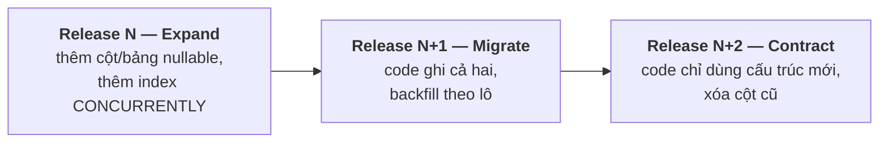

| Quy tắc | Lý do |
|---------|------|
| Không đổi tên/xóa cột trong cùng release với code dùng nó | Bản cũ còn chạy trong canary |
| Tạo index lớn bằng `CREATE INDEX CONCURRENTLY` | Tránh khóa bảng |
| Migration phá hủy cần duyệt riêng | ERD §20: "Destructive migrations require explicit review" |
| Backfill lớn chạy như job riêng, theo lô | Không kéo dài PreSync hook |
| Không bao giờ sửa schema tay trên RDS | Principle XIV |

## 10.4 Rollback

| Tình huống | Cách rollback | Thời gian |
|-----------|--------------|----------|
| Canary thất bại | Argo Rollouts tự abort | Tự động, < 1 phút |
| Lỗi phát hiện sau khi lên 100% | `git revert` commit trong `envs/prod` → Argo CD sync bản cũ | < 5 phút |
| Khẩn cấp, Git không khả dụng | `argocd app rollback` về revision trước (ghi lại, sau đó đồng bộ Git) | < 2 phút |
| Migration lỗi | Job thất bại → sync dừng, bản cũ vẫn chạy; sửa bằng migration tiến (forward fix) | — |
| Dữ liệu hỏng | RDS PITR sang instance mới, chuyển kết nối | Theo RTO (§14) |

Rollback code **không** rollback schema. Nhờ expand/contract, bản cũ vẫn chạy được trên schema mới.

---

# 11. Observability

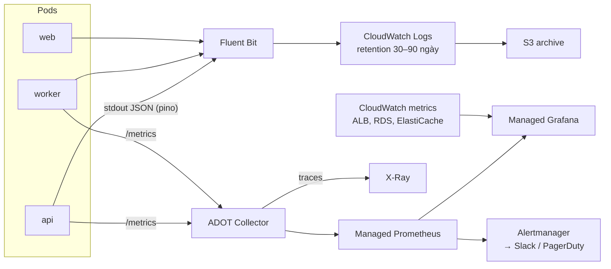

**Dashboard và cảnh báo đề xuất:**

| Tín hiệu | Cảnh báo khi |
|----------|-------------|
| ALB 5xx trên `/api/webhooks/github` | > 1% trong 5 phút |
| Độ trễ webhook p95 | > 2 s trong 10 phút (mục tiêu plan); > 8 s là khẩn (gần giới hạn 10 s của GitHub) |
| Webhook bị từ chối (chữ ký sai) | Tăng đột biến — có thể là tấn công hoặc secret bị lệch sau xoay vòng |
| Độ dài hàng đợi `reconcile`/`sync` | > 500 trong 15 phút dù đã scale tối đa |
| Sync thất bại (`REPOSITORY_SYNC_FAILED`) | Tỉ lệ > 5% |
| RDS CPU, connection, replica lag, dung lượng | Ngưỡng chuẩn |
| ElastiCache memory | > 75% (với `noeviction`, đầy bộ nhớ là ghi job thất bại) |
| Pod restart, OOMKilled | Bất kỳ ở prod |
| Argo CD app OutOfSync/Degraded | > 10 phút |

**Ràng buộc từ Constitution XIII và XI:** log vẫn không chứa body webhook, nội dung repo hay bí mật; danh sách redaction của pino giữ nguyên. Fluent Bit **không** được cấu hình để làm giàu log bằng biến môi trường của pod (có thể chứa bí mật).

---

# 12. Bảo mật chuỗi cung ứng và runtime

## 12.1 Chuỗi cung ứng

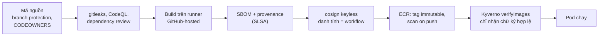

```yaml
# Kyverno: chỉ chạy image do workflow chính thức của repo CodeLens ký
apiVersion: kyverno.io/v1
kind: ClusterPolicy
metadata: { name: verify-codelens-images }
spec:
  validationFailureAction: Enforce
  webhookTimeoutSeconds: 30
  rules:
    - name: verify-signature
      match:
        any:
          - resources: { kinds: [Pod], namespaces: [codelens, codelens-staging, codelens-dev] }
      verifyImages:
        - imageReferences: ["111111111111.dkr.ecr.*.amazonaws.com/codelens/*"]
          mutateDigest: true
          verifyDigest: true
          attestors:
            - entries:
                - keyless:
                    issuer: https://token.actions.githubusercontent.com
                    subject: "https://github.com/<org>/CodeLens/.github/workflows/release.yml@refs/heads/main"
                    rekor: { url: https://rekor.sigstore.dev }
```

## 12.2 Runtime

| Lớp | Biện pháp |
|-----|----------|
| Pod | Non-root (Dockerfile đã dùng `USER node`), `readOnlyRootFilesystem`, bỏ mọi capability, seccomp `RuntimeDefault`, Pod Security Standard `restricted` |
| Mạng | NetworkPolicy default-deny (§6.5); Security Groups for Pods cho DB |
| IAM | Pod Identity: `api`/`worker` chỉ đọc đúng path Secrets Manager; không pod nào có quyền quản trị AWS |
| Phát hiện | GuardDuty EKS Runtime Monitoring |
| GitHub App sản phẩm | Vẫn chỉ đọc; API/worker **từ chối khởi động** nếu app có quyền ghi (`startup-refusal.spec.ts`) — hành vi này giữ nguyên trên EKS và sẽ làm pod CrashLoop, được phát hiện ngay ở canary |
| Bí mật | Xoay vòng bằng Secrets Manager; ESO làm mới mỗi giờ; cần rollout lại pod để đọc file mới (hoặc dùng Reloader) |

**Lưu ý khi xoay vòng webhook secret:** GitHub chỉ giữ một secret cho mỗi app. Trong khoảng thời gian giữa lúc đổi trên GitHub và lúc pod đọc secret mới, webhook sẽ bị từ chối (401) và GitHub **không tự gửi lại**. 💡 Cần hỗ trợ tạm thời chấp nhận hai secret (cũ và mới) khi xác thực — đây là thay đổi code và thuộc feature "xoay vòng bí mật" mà spec đã để ngoài phạm vi.

---

# 13. Autoscaling và năng lực

| Tầng | Cơ chế | Tín hiệu |
|------|-------|---------|
| Pod `api`, `web` | HPA | CPU 60%; 💡 request/s qua Prometheus adapter |
| Pod `worker` | KEDA | Độ dài list `bull:<queue>:wait` |
| Node | Karpenter | Pod pending; gom node (consolidation) khi thừa |
| RDS | Tăng instance class (thủ công, có kế hoạch); storage autoscaling | CPU, connection |
| ElastiCache | Thêm replica / tăng node type | Memory, CPU |

**Ước lượng năng lực ban đầu cho prod (cần đo lại bằng load test ở staging):**

| Thành phần | Tối thiểu | Tối đa |
|-----------|----------|-------|
| `api` | 3 pod × 0,25 vCPU | 20 pod |
| `worker` | 2 pod | 50 pod (giới hạn bởi rate limit GitHub/LLM, không phải bởi CPU) |
| `web` | 2 pod | 10 pod |
| Node `system` | 3 × `m7g.large` | cố định |
| Node app + worker | Karpenter quyết định | Giới hạn `limits.cpu` của NodePool để chặn chi phí vượt kiểm soát |

**Kiểm soát chi phí:** Graviton cho mọi thứ; Spot cho worker; VPC endpoints giảm phí NAT; Karpenter consolidation; ECR lifecycle policy; Savings Plans cho phần tải nền ổn định; AWS Budgets cảnh báo theo tài khoản. Chi phí cụ thể nên ước tính bằng AWS Pricing Calculator khi đã có số liệu tải thật.

---

# 14. Disaster recovery

| Thành phần | Chiến lược | RPO | RTO |
|-----------|-----------|-----|-----|
| PostgreSQL | Multi-AZ + PITR; snapshot copy sang region DR | ≤ 5 phút | ≤ 1 giờ |
| Redis | Multi-AZ auto failover; snapshot hằng ngày | Session và job đang chờ có thể mất vài giây | Phút |
| Trạng thái cluster | Tái tạo từ Terraform + `codelens-gitops` | 0 (nằm trong Git) | ≤ 1 giờ cho cluster mới |
| Image | ECR replication sang region DR | 0 | — |
| Bí mật | Secrets Manager replica sang region DR | 0 | — |

**Mất Redis không làm hỏng dữ liệu:** GitHub vẫn là nguồn sự thật cho trạng thái GitHub; sau khi Redis phục hồi, OWNER bấm "Sync now" hoặc một job reconcile định kỳ đưa mọi installation về đúng trạng thái (system-design §6.1, §6.9). Người dùng phải đăng nhập lại vì mất session.

**Diễn tập:** khôi phục RDS từ PITR sang staging mỗi quý; mô phỏng mất một AZ (AWS Fault Injection Service) ở staging mỗi nửa năm.

---

# 15. Điều kiện tiên quyết trong code

Đối chiếu với code hiện tại trên nhánh `001-github-app-onboarding`:

| # | Cần có | Hiện trạng | Mức độ |
|---|-------|-----------|-------|
| 1 | Endpoint `/api/health/live` và `/api/health/ready` | **Chưa có** | Bắt buộc trước EKS (probe) |
| 2 | Endpoint `/metrics` định dạng Prometheus (request count, latency theo route, độ dài hàng đợi) | **Chưa có** — metrics hiện chỉ ghi snapshot vào log mỗi phút (`metrics-reporter.ts`) | Bắt buộc cho canary analysis |
| 3 | Tin cậy proxy (`trust proxy`) để đọc đúng IP client sau CloudFront/ALB | **Chưa thấy cấu hình** | Bắt buộc — ảnh hưởng hash IP trong log từ chối webhook |
| 4 | TLS tới Redis (`rediss://`) và Postgres (`sslmode=verify-full`) | ioredis và Prisma hỗ trợ qua URL; cần kiểm thử | Kiểm chứng |
| 5 | Xử lý `SIGTERM` | **Đã có**: `app.enableShutdownHooks()`, worker bắt `SIGTERM`/`SIGINT` | ✅ |
| 6 | Đọc bí mật từ file mount | **Đã có**: `EnvSecretProvider` hỗ trợ `<NAME>_FILE` | ✅ |
| 7 | Session không lưu trong bộ nhớ tiến trình | **Đã có**: session ở Redis → `api` scale ngang được | ✅ |
| 8 | Khóa phân tán cho sync/reconcile | **Đã có**: `pg_advisory_xact_lock` trong DB → an toàn với nhiều pod worker | ✅ |
| 9 | Image multi-arch | Dockerfile dùng `node:22-alpine` (đa kiến trúc); cần build `--platform` trong CI | Chỉ CI |
| 10 | Chấp nhận hai webhook secret khi xoay vòng | **Chưa có**, ngoài phạm vi Feature 001 | Nên có trước khi xoay vòng ở prod |
| 11 | Job reconcile định kỳ cho mọi installation ACTIVE | **Chưa có** | Nên có (phục hồi sau sự cố Redis/webhook bị mất) |

Mục 1–3 là thay đổi code thật; theo quy trình dự án cần có spec/task riêng, không thêm như tác dụng phụ.

---

# 16. Lộ trình chuyển đổi từ MVP

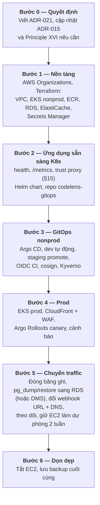

**Kế hoạch chuyển dữ liệu (Bước 5):**

1. Hạ TTL DNS trước 24 giờ.
2. Deploy prod trên EKS trỏ vào RDS trống; chạy migration.
3. Cửa sổ bảo trì: dừng `api` và `worker` trên EC2; `pg_dump` → `pg_restore` vào RDS; kiểm tra số dòng các bảng chính.
4. Đổi DNS sang CloudFront. Webhook URL của GitHub App giữ nguyên tên miền nên không cần sửa app.
5. Webhook đến trong cửa sổ bảo trì sẽ thất bại; sau khi chuyển, OWNER hoặc một job một-lần chạy **reconcile cho mọi installation** để hội tụ về trạng thái GitHub (thiết kế reconcile-from-GitHub làm việc này an toàn và idempotent).
6. Session cũ trong Redis EC2 không được chuyển → người dùng đăng nhập lại (chấp nhận được).
7. Giữ EC2 ở trạng thái dừng kèm snapshot 2 tuần để rollback.

---

## Phụ lục — Bảng quyết định tóm tắt

| Quyết định | Chọn | Phương án loại | Lý do |
|-----------|------|---------------|-------|
| Orchestrator | EKS | ECS Fargate | Hệ sinh thái GitOps (Argo CD, Rollouts, KEDA), yêu cầu của đề bài; ECS đơn giản hơn nếu không cần các thứ đó |
| Công cụ CD | Argo CD (pull) | Push từ CI bằng `kubectl`/`helm` | CI không giữ credential cluster; drift tự sửa; audit bằng Git |
| Số Argo CD | Mỗi cluster một | Hub trung tâm | Giảm blast radius |
| Đóng gói | Helm chart trong repo GitOps | Kustomize | Tham số hóa theo môi trường, hook, dùng chung cho Rollouts |
| Cập nhật image | CI commit digest vào Git | Argo CD Image Updater | Mọi deploy là commit có người/bot rõ ràng; prod bắt buộc PR |
| Bí mật | Secrets Manager + ESO → file | Sealed Secrets, SOPS | Xoay vòng tập trung, không có bí mật (kể cả mã hóa) trong Git, không cần đổi code |
| Hàng đợi | Giữ BullMQ trên ElastiCache | SQS | Không đổi code; SQS xét lại ở Stage 3 |
| DB | RDS PostgreSQL Multi-AZ | Aurora ngay từ đầu | Rẻ hơn, đủ cho giai đoạn đầu; Aurora khi cần |
| Autoscale worker | KEDA theo hàng đợi | HPA theo CPU | Worker chờ I/O; CPU không phản ánh tải |
| Release prod | Canary + phân tích tự động | Blue/green | Tiết kiệm tài nguyên; phát hiện lỗi với ít người dùng |
