# CodeLens — Tài liệu System Design

**Phiên bản:** 0.1 · **Ngày:** 2026-09-30 · **Nhánh tham chiếu:** `001-github-app-onboarding`

Tài liệu này tổng hợp toàn bộ yêu cầu và thiết kế của CodeLens theo trình tự:

```text
Requirement → Core Entity → API / Interface → Data Workflow → High-level Design → Deep dive & Scale
```

**Nguồn (theo thứ tự ưu tiên, trùng với `CLAUDE.md`):**

1. [.specify/memory/constitution.md](../../.specify/memory/constitution.md) — 18 nguyên tắc (I–XVIII)
2. [docs/adr/0001-architecture.md](../adr/0001-architecture.md) — ADR-001 đến ADR-020
3. [docs/architecture/database-erd.md](database-erd.md) — ERD v0.1 và Amendment 1
4. [specs/001-github-app-onboarding/](../../specs/001-github-app-onboarding/) — spec, plan, research, data-model, contracts
5. [roadmap.md](../../roadmap.md) — tầm nhìn sản phẩm và các phase

> **Quy ước trạng thái.** Mỗi phần được gắn nhãn:
> - ✅ **Đã hiện thực** — có trong code của Feature 001 và đã qua kiểm thử (xem `quickstart.md`, mục "Results of the last full run").
> - 🧭 **Baseline** — đã chốt trong ADR/ERD/Constitution nhưng thuộc feature sau, chưa có code.
> - 💡 **Đề xuất** — thiết kế do tài liệu này đề xuất để lấp khoảng trống; **không** phải quyết định đã chốt. Muốn áp dụng phải đi theo quy trình Principle XV (ADR → spec → plan → code).
>
> Tài liệu này **không** thay đổi ADR, ERD hay spec. Chỗ nào lệch với các tài liệu đó thì các tài liệu đó đúng.

---

## Mục lục

1. [Requirement](#1-requirement)
2. [Core Entity](#2-core-entity)
3. [API / Interface](#3-api--interface)
4. [Data Workflow](#4-data-workflow)
5. [High-level Design](#5-high-level-design)
6. [Deep dive & Scale](#6-deep-dive--scale)
7. [Phụ lục](#7-phụ-lục)

---

# 1. Requirement

## 1.1 Bài toán

CodeLens là **nền tảng review code bằng AI, tích hợp với GitHub dưới dạng GitHub App**. Người dùng cài app lên tài khoản/tổ chức GitHub, chọn repository, và CodeLens tự động review Pull Request và Issue, theo luật riêng của từng repository (`.codelens.yml`), với model AI cấu hình được theo từng loại tác vụ, và có quản trị ở cấp tổ chức. Mục tiêu dài hạn là phát hành trên GitHub Marketplace (ADR-001, ADR-016).

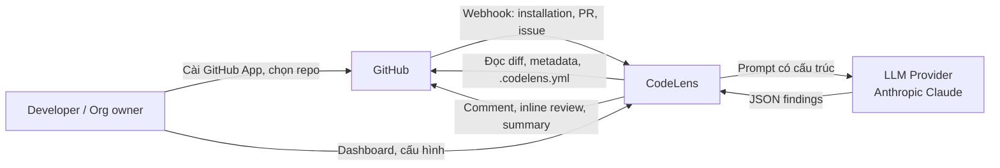
```mermaid
flowchart LR
    Dev["Developer / Org owner"] -->|"Cài GitHub App, chọn repo"| GH["GitHub"]
    GH -->|"Webhook: installation, PR, issue"| CL["CodeLens"]
    CL -->|"Đọc diff, metadata, .codelens.yml"| GH
    CL -->|"Prompt có cấu trúc"| LLM["LLM Provider<br/>Anthropic Claude"]
    LLM -->|"JSON findings"| CL
    CL -->|"Comment, inline review, summary"| GH
    Dev -->|"Dashboard, cấu hình"| CL
```

## 1.2 Lộ trình tính năng

| Phase | Nội dung | Trạng thái |
|-------|----------|-----------|
| 0 | Product / Architecture (ADR, ERD, Constitution) | ✅ Xong |
| 1 | Spec Kit workflow | ✅ Đang dùng |
| 2 | **Feature 001 — GitHub App installation & repository onboarding** | ✅ Đã hiện thực (còn Gate G1) |
| 3 | AI Review MVP: PR → diff → Claude → structured findings → GitHub comments | 🧭 |
| 4 | `.codelens.yml`, review profiles, model routing | 🧭 |
| 5 | Dashboard, quản lý AI provider (BYOK), quản lý repo | 🧭 |
| 6 | Issue review, PR chat, codebase intelligence | 🧭 |
| 7 | Static analysis, security, architecture review | 🧭 |
| 8 | Marketplace, gói Free/Paid, billing | 🧭 |

## 1.3 Functional Requirements

### A. Nền tảng (toàn sản phẩm) — 🧭 Baseline

| ID | Yêu cầu | Nguồn |
|----|---------|-------|
| P-01 | Tích hợp GitHub chủ yếu qua **GitHub App**; không dùng personal access token làm cơ chế ủy quyền | ADR-001, Principle I |
| P-02 | Tự động review PR khi mở và khi có commit mới; hỗ trợ `/review` thủ công; review tăng dần (incremental) | Roadmap §2A |
| P-03 | Sinh PR summary, inline comment, severity, gợi ý sửa | ADR-013, Roadmap |
| P-04 | Phân tích Issue: tóm tắt, phân loại, phát hiện trùng, xác định module bị ảnh hưởng | Roadmap §3 |
| P-05 | Cấu hình review theo repo bằng `.codelens.yml`, phân tầng: system → org → repo → runtime override | ADR-007, Principle X |
| P-06 | Định tuyến model theo tác vụ (PR_SUMMARY, CODE_REVIEW, SECURITY_REVIEW, ARCHITECTURE_REVIEW, ISSUE_ANALYSIS, PR_CHAT) | ADR-004, Principle VI |
| P-07 | Trừu tượng hóa provider (`ModelProvider`); Anthropic trước, OpenAI/Google sau | ADR-004, Principle V |
| P-08 | BYOK: người dùng tự cung cấp API key Anthropic, lưu mã hóa hoặc tham chiếu bí mật | ADR-008 |
| P-09 | Output AI phải là dữ liệu có cấu trúc, qua validate trước khi đăng lên GitHub | ADR-005, Principle VII |
| P-10 | Tách finding của AI và finding của static analysis (ESLint, Semgrep, PMD…) | ADR-014 |
| P-11 | Lưu lịch sử review, finding, usage/cost; audit các hành động nhạy cảm | ADR-012, ADR-019 |
| P-12 | AI chỉ tư vấn: không approve, không merge, không push code, không sửa workflow | ADR-013, Principle II |
| P-13 | Sẵn sàng cho Marketplace: plan, subscription, usage limit | ADR-016 |

### B. Feature 001 — GitHub App Installation & Repository Onboarding — ✅ Đã hiện thực

| Nhóm | ID | Tóm tắt |
|------|----|---------|
| Danh tính | FR-001 → FR-004 | Đăng nhập bằng GitHub, không cần PAT; tài khoản gắn với **GitHub user ID dạng số** (bền khi đổi username); đăng nhập **không** tự cấp quyền vào installation nào; khách chưa đăng nhập không thấy dữ liệu tenant |
| Cài đặt | FR-005 → FR-010 | Bắt đầu cài từ CodeLens; chỉ liên kết installation khi **GitHub xác nhận** user có quyền truy cập; chọn repo chỉ trong flow của GitHub; mỗi installation thuộc đúng một Organization (tenant); installation ID là ranh giới ủy quyền |
| Đồng bộ repo | FR-011 → FR-017 | Đồng bộ tối đa **5.000 repo/installation** (vượt thì lấy 5.000 ID nhỏ nhất, cảnh báo); idempotent; repo thuộc đúng một org + một installation; repo mới mặc định **disabled**; lỗi đồng bộ không làm hỏng dữ liệu cũ, retry ≥ 3 lần |
| Hiển thị | FR-018 → FR-020, FR-040, FR-041 | Cây Installation → Organization → Repositories → bật/tắt; ma trận quyền; 6 trạng thái hiển thị installation, 3 trạng thái repo; **không lộ sự tồn tại** của tài nguyên tenant khác |
| Bật/tắt | FR-021 → FR-023 | Chỉ OWNER bật/tắt; **quy tắc đủ điều kiện review (eligibility)** duy nhất; audit mọi thao tác |
| Vòng đời | FR-024 → FR-027 | Gỡ cài → REMOVED; suspend/unsuspend; cài lại = installation mới cùng org |
| Webhook | FR-028 → FR-031 | Xác thực chữ ký HMAC; xử lý mỗi delivery tối đa một lần về mặt hiệu lực; đúng khi sự kiện đến trễ/sai thứ tự; ACK trong **10 giây** |
| Quyền & bí mật | FR-032 → FR-034 | App chỉ xin quyền **read**; không lưu/log/lộ bí mật; token ngắn hạn chỉ ở server |
| Vai trò | FR-035 → FR-039 | OWNER/MEMBER lấy từ GitHub; thao tác quản trị cần xác nhận vai trò trong **10 phút** gần nhất; GitHub không trả lời được → từ chối (fail closed) |

**Ma trận quyền (FR-040):**

| Hành động | Khách | Đã đăng nhập, không là thành viên | MEMBER | OWNER |
|-----------|:-----:|:--:|:--:|:--:|
| Đăng nhập | ✔ | – | – | – |
| Bắt đầu cài app trên GitHub | ✘ | ✔ | ✔ | ✔ |
| Làm mới quyền từ GitHub | ✘ | ✔ | ✔ | ✔ |
| Xem installation, org, repo, trạng thái | ✘ | ✘ | ✔ | ✔ |
| Bật/tắt review cho repo | ✘ | ✘ | ✘ | ✔ |
| Chạy lại đồng bộ | ✘ | ✘ | ✘ | ✔ |

## 1.4 Non-functional Requirements

| Loại | Yêu cầu | Chỉ số đo | Nguồn |
|------|---------|-----------|-------|
| **Độ trễ webhook** | ACK mọi delivery trước timeout của GitHub | Giới hạn cứng 10 s; mục tiêu **p95 < 2 s** | FR-031, plan |
| **Độ phản hồi onboarding** | Installation và repo hiển thị sau khi GitHub cài xong | **p95 ≤ 30 s**, p99 ≤ 2 phút (≤ 500 repo) | SC-002 |
| **Throughput đồng bộ** | 500 repo đồng bộ xong | < 2 phút | SC-003 |
| **Thời gian onboarding** | Từ lần đầu vào đến thấy repo | < 5 phút, không token | SC-001 |
| **Thu hồi quyền** | Gỡ app → mọi repo không còn đủ điều kiện | ≤ 1 phút | SC-009 |
| **Idempotency** | 10 lần cùng một delivery ≡ 1 lần | 0 bản ghi trùng | SC-005, SC-006 |
| **Cô lập tenant** | Không rò rỉ dữ liệu giữa tenant | 0% | SC-007, Principle III |
| **Bảo mật bí mật** | Không bí mật nào trong trình duyệt, log, Git, image | 0 phát hiện khi scan | SC-010, SC-013 |
| **Least privilege** | Mọi quyền của app là read-only (trong Feature 001) | 100% | SC-014 |
| **Khả năng kiểm thử** | Chạy end-to-end không cần GitHub thật, không gọi LLM thật | Fake GitHub + fixture ký sẵn | SC-011, Principle XII |
| **Quan sát được** | Mọi job truy vết được qua ID; log có cấu trúc, không chứa nội dung repo | — | ADR-019, Principle XIII |
| **Chi phí vận hành** | 1 EC2, Docker Compose; không K8s/RDS/ElastiCache ở MVP | — | ADR-015, Principle XVI |
| **Khả năng tiến hóa** | Di chuyển sang dịch vụ managed mà không đổi business logic | — | Principle XVIII |

**Ưu tiên khi xung đột:** An toàn > tiện lợi (Principle XVII). Ví dụ: không lưu user token → phải xác nhận lại với GitHub khi quản trị; GitHub sập → chặn quản trị (fail closed) nhưng vẫn cho xem.

## 1.5 Ràng buộc và ngoài phạm vi

**Ràng buộc kỹ thuật (ADR-002, 003, 010, 015):** TypeScript strict trên Node.js 22; NestJS (API + worker), Next.js App Router + React + Tailwind + shadcn/ui; PostgreSQL 16; Redis 7 + BullMQ; Prisma; Octokit; pino; zod.

**Ngoài phạm vi Feature 001:** AI review, parse `.codelens.yml`, cấu hình AI provider, model routing, billing, auto-fix, comment PR, approve PR, mọi thao tác ghi lên repo, chính sách xóa dữ liệu, xoay vòng bí mật.

## 1.6 Ước lượng quy mô (back-of-the-envelope)

> 💡 Các con số dưới đây là **giả định để định cỡ hệ thống**, không phải cam kết trong spec. Plan của Feature 001 chỉ nêu quy mô MVP: "hàng chục organization, vài trăm repo mỗi installation, tốc độ webhook thấp".

| Đại lượng | MVP (giả định) | Mục tiêu mở rộng (giả định) |
|-----------|---------------|------------------------------|
| Organization | 50 | 10.000 |
| Repo đã bật review | 1.000 | 100.000 |
| Sự kiện PR cần review / repo / ngày (opened + synchronize) | 3 | 3 |
| Review job / ngày | 3.000 | 300.000 |
| Tốc độ review trung bình | ~0,035 job/s | ~3,5 job/s |
| Đỉnh (×10 giờ làm việc) | ~0,35 job/s | ~35 job/s |
| Token / review (tất cả tác vụ) | ~30k in + 3k out | như trên |
| Token / ngày | ~100 triệu | ~10 tỷ |
| Thời gian một review (LLM) | 20–90 s | như trên |
| Review đang chạy đồng thời ở đỉnh (Little's law: λ × W, W ≈ 60 s) | ~20 | ~2.100 |
| Finding / review | ~5 | ~5 |
| Dữ liệu `review_findings` / năm (~1 KB/dòng) | ~5 GB | ~550 GB |
| Webhook delivery / ngày (mọi loại sự kiện) | ~10k | ~1 triệu |

**Nhận xét định cỡ:**

- Ở MVP, **một EC2 là đủ**: nút thắt không phải CPU mà là **độ trễ LLM** và **rate limit của provider/GitHub**. Worker chủ yếu chờ I/O.
- Ở quy mô mở rộng, cần hàng nghìn review đồng thời → worker phải scale ngang, có **hàng đợi theo loại việc**, **giới hạn đồng thời theo tenant** và **token bucket theo provider** (xem §6.8).
- Bảng tăng nhanh nhất: `review_findings`, `usage_records`, `webhook_deliveries`, `audit_logs` → cần partition theo thời gian và chính sách lưu trữ khi lớn (§6.8).

---

# 2. Core Entity

## 2.1 Bản đồ miền (domain map)

ERD chia dữ liệu thành 6 miền. Feature 001 dùng miền **Identity**, **GitHub Integration** và **Audit**.

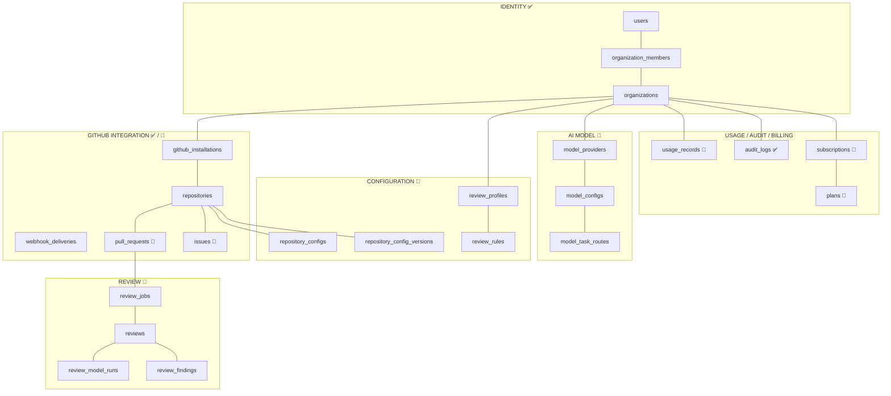
```mermaid
flowchart TB
    subgraph ID["IDENTITY ✅"]
        U[users]
        OM[organization_members]
        O[organizations]
    end
    subgraph GI["GITHUB INTEGRATION ✅ / 🧭"]
        GIN[github_installations]
        R[repositories]
        WD[webhook_deliveries]
        PR["pull_requests 🧭"]
        IS["issues 🧭"]
    end
    subgraph CFG["CONFIGURATION 🧭"]
        RC[repository_configs]
        RCV[repository_config_versions]
        RP[review_profiles]
        RR[review_rules]
    end
    subgraph AI["AI MODEL 🧭"]
        MP[model_providers]
        MC[model_configs]
        MTR[model_task_routes]
    end
    subgraph RV["REVIEW 🧭"]
        RJ[review_jobs]
        RVW[reviews]
        RMR[review_model_runs]
        RF[review_findings]
    end
    subgraph UAB["USAGE / AUDIT / BILLING"]
        UR["usage_records 🧭"]
        AL["audit_logs ✅"]
        PL["plans 🧭"]
        SUB["subscriptions 🧭"]
    end

    U --- OM --- O
    O --- GIN --- R
    R --- PR
    R --- IS
    R --- RC
    R --- RCV
    O --- RP --- RR
    O --- MP --- MC --- MTR
    PR --- RJ --- RVW
    RVW --- RMR
    RVW --- RF
    O --- UR
    O --- AL
    O --- SUB --- PL
```

## 2.2 Các thực thể cốt lõi

| Thực thể | Ý nghĩa | Khóa định danh bền | Trạng thái |
|----------|---------|-------------------|-----------|
| **User** | Tài khoản CodeLens, gắn vĩnh viễn với một GitHub user | `github_user_id` (UNIQUE) — không dùng `login` vì username đổi được | ✅ |
| **Organization** | **Tenant**. Một GitHub organization *hoặc* tài khoản cá nhân (`account_type = ORGANIZATION \| USER`) | `github_org_id` (UNIQUE) | ✅ |
| **OrganizationMember** | User ↔ Organization với vai trò `OWNER`/`MEMBER` lấy từ GitHub, cùng `role_verified_at` | UNIQUE `(organization_id, user_id)` | ✅ |
| **GithubInstallation** | Một lần cài GitHub App. **Ranh giới bảo mật** giữa CodeLens và GitHub. Cài lại = dòng mới | `github_installation_id` (UNIQUE) | ✅ |
| **Repository** | Bản cache metadata repo từ GitHub, cộng lựa chọn của CodeLens (`review_enabled`) | `github_repository_id` (UNIQUE) | ✅ |
| **WebhookDelivery** | Nhật ký mỗi delivery của GitHub để khử trùng lặp và truy vết; **không lưu body**, chỉ `payload_sha256` | `delivery_guid` (UNIQUE) | ✅ |
| **AuditLog** | Hành động nhạy cảm: ai, làm gì, lên cái gì, khi nào; không chứa bí mật | — | ✅ |
| **PullRequest / Issue** | Bản chiếu PR/Issue; PR tồn tại độc lập với review (một PR nhiều review theo commit) | `(repository_id, number)` | 🧭 |
| **RepositoryConfig / ConfigVersion** | Cấu hình hiệu lực và lịch sử phiên bản `.codelens.yml` | `(repository_id, version)` | 🧭 |
| **ReviewProfile / ReviewRule** | Bộ luật có tên (`backend-java`, `security`…) | — | 🧭 |
| **ModelProvider / ModelConfig / ModelTaskRoute** | Provider (kèm `credential_reference`), model, và định tuyến tác vụ → model | Route không mơ hồ theo `(org, profile, task, priority)` | 🧭 |
| **ReviewJob** | Đơn vị **thực thi bất đồng bộ** (status, attempt) | `idempotency_key` (UNIQUE) | 🧭 |
| **Review** | Đơn vị **review logic** cho một commit; retry dùng lại, không tạo mới | `(pull_request_id, commit_sha)` + loại review | 🧭 |
| **ReviewModelRun** | Một lần gọi model cho một tác vụ: token, chi phí, độ trễ | — | 🧭 |
| **ReviewFinding** | Đơn vị nguyên tử của kết quả review | `fingerprint` | 🧭 |
| **UsageRecord** | Bản ghi chỉ-thêm về token, chi phí, số review | — | 🧭 |
| **Plan / Subscription** | Chỗ trống cho Marketplace | — | 🧭 |

## 2.3 ERD — phần đã hiện thực (Feature 001)

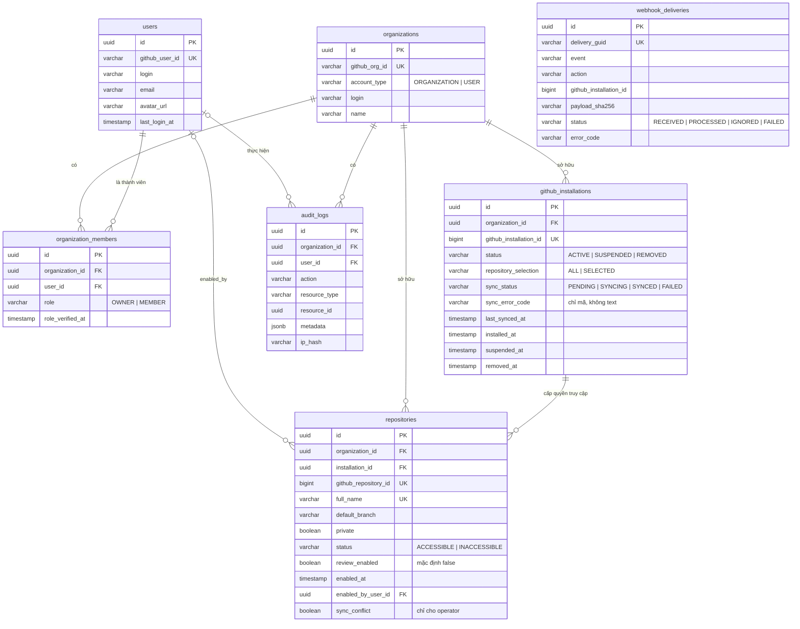
```mermaid
erDiagram
    users ||--o{ organization_members : "là thành viên"
    organizations ||--o{ organization_members : "có"
    organizations ||--o{ github_installations : "sở hữu"
    github_installations ||--o{ repositories : "cấp quyền truy cập"
    organizations ||--o{ repositories : "sở hữu"
    users |o--o{ repositories : "enabled_by"
    organizations ||--o{ audit_logs : "có"
    users |o--o{ audit_logs : "thực hiện"

    users {
        uuid id PK
        varchar github_user_id UK
        varchar login
        varchar email
        varchar avatar_url
        timestamp last_login_at
    }
    organizations {
        uuid id PK
        varchar github_org_id UK
        varchar account_type "ORGANIZATION | USER"
        varchar login
        varchar name
    }
    organization_members {
        uuid id PK
        uuid organization_id FK
        uuid user_id FK
        varchar role "OWNER | MEMBER"
        timestamp role_verified_at
    }
    github_installations {
        uuid id PK
        uuid organization_id FK
        bigint github_installation_id UK
        varchar status "ACTIVE | SUSPENDED | REMOVED"
        varchar repository_selection "ALL | SELECTED"
        varchar sync_status "PENDING | SYNCING | SYNCED | FAILED"
        varchar sync_error_code "chỉ mã, không text"
        timestamp last_synced_at
        timestamp installed_at
        timestamp suspended_at
        timestamp removed_at
    }
    repositories {
        uuid id PK
        uuid organization_id FK
        uuid installation_id FK
        bigint github_repository_id UK
        varchar full_name UK
        varchar default_branch
        boolean private
        varchar status "ACCESSIBLE | INACCESSIBLE"
        boolean review_enabled "mặc định false"
        timestamp enabled_at
        uuid enabled_by_user_id FK
        boolean sync_conflict "chỉ cho operator"
    }
    webhook_deliveries {
        uuid id PK
        varchar delivery_guid UK
        varchar event
        varchar action
        bigint github_installation_id
        varchar payload_sha256
        varchar status "RECEIVED | PROCESSED | IGNORED | FAILED"
        varchar error_code
    }
    audit_logs {
        uuid id PK
        uuid organization_id FK
        uuid user_id FK
        varchar action
        varchar resource_type
        uuid resource_id
        jsonb metadata
        varchar ip_hash
    }
```

## 2.4 ERD — miền Review và Model (🧭 Baseline cho các feature sau)

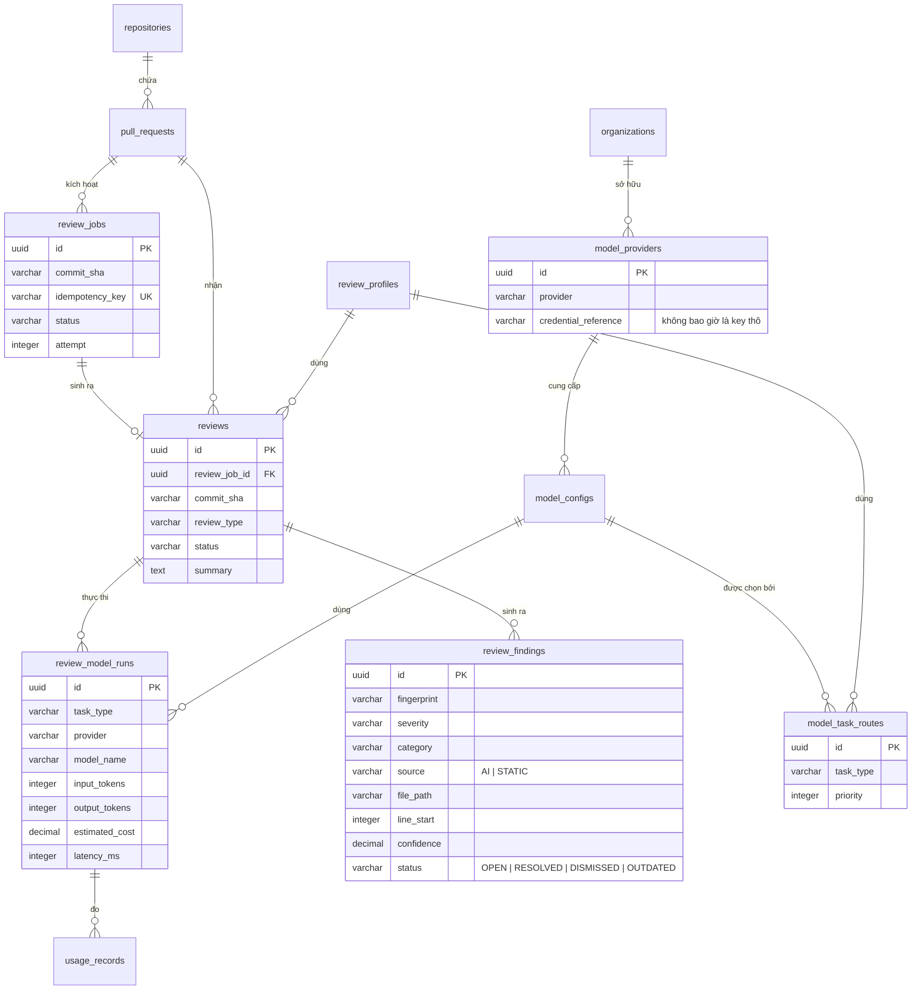
```mermaid
erDiagram
    repositories ||--o{ pull_requests : "chứa"
    pull_requests ||--o{ review_jobs : "kích hoạt"
    review_jobs ||--o| reviews : "sinh ra"
    pull_requests ||--o{ reviews : "nhận"
    review_profiles ||--o{ reviews : "dùng"
    reviews ||--o{ review_model_runs : "thực thi"
    reviews ||--o{ review_findings : "sinh ra"
    organizations ||--o{ model_providers : "sở hữu"
    model_providers ||--o{ model_configs : "cung cấp"
    model_configs ||--o{ model_task_routes : "được chọn bởi"
    review_profiles ||--o{ model_task_routes : "dùng"
    model_configs ||--o{ review_model_runs : "dùng"
    review_model_runs ||--o{ usage_records : "đo"

    review_jobs {
        uuid id PK
        varchar commit_sha
        varchar idempotency_key UK
        varchar status
        integer attempt
    }
    reviews {
        uuid id PK
        uuid review_job_id FK
        varchar commit_sha
        varchar review_type
        varchar status
        text summary
    }
    review_model_runs {
        uuid id PK
        varchar task_type
        varchar provider
        varchar model_name
        integer input_tokens
        integer output_tokens
        decimal estimated_cost
        integer latency_ms
    }
    review_findings {
        uuid id PK
        varchar fingerprint
        varchar severity
        varchar category
        varchar source "AI | STATIC"
        varchar file_path
        integer line_start
        decimal confidence
        varchar status "OPEN | RESOLVED | DISMISSED | OUTDATED"
    }
    model_providers {
        uuid id PK
        varchar provider
        varchar credential_reference "không bao giờ là key thô"
    }
    model_task_routes {
        uuid id PK
        varchar task_type
        integer priority
    }
```

**Vì sao tách Job / Review / ModelRun / Finding (Principle VIII):**

| Khái niệm | Câu hỏi nó trả lời | Hệ quả thiết kế |
|-----------|-------------------|-----------------|
| ReviewJob | "Lần chạy nền này đang ở đâu, lần thử thứ mấy?" | Retry tăng `attempt`, không tạo Review mới |
| Review | "Commit X của PR được review ra sao?" | Một Review cho mỗi `(PR, commit, loại, profile)` |
| ReviewModelRun | "Tác vụ nào dùng model nào, tốn bao nhiêu?" | Phân tích chi phí/độ trễ theo tác vụ, so sánh model |
| ReviewFinding | "Vấn đề cụ thể nào, đã đăng chưa, đã xử lý chưa?" | Khử trùng lặp bằng fingerprint, theo dõi false positive |

## 2.5 Máy trạng thái

### Installation `status` (✅)

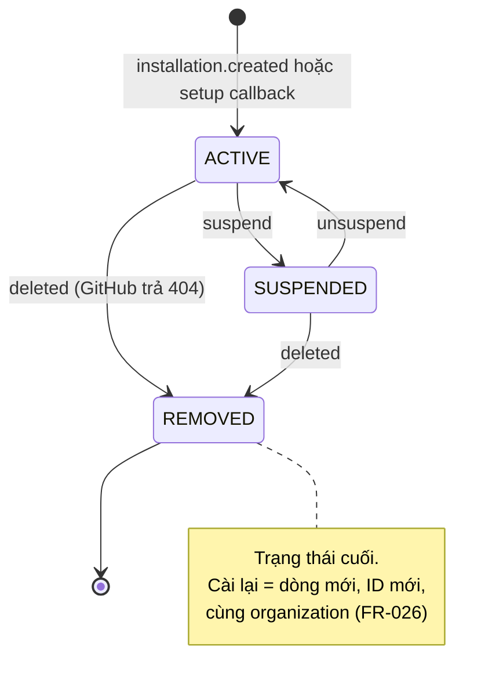
```mermaid
stateDiagram-v2
    [*] --> ACTIVE: installation.created hoặc setup callback
    ACTIVE --> SUSPENDED: suspend
    SUSPENDED --> ACTIVE: unsuspend
    ACTIVE --> REMOVED: deleted (GitHub trả 404)
    SUSPENDED --> REMOVED: deleted
    REMOVED --> [*]
    note right of REMOVED
        Trạng thái cuối.
        Cài lại = dòng mới, ID mới,
        cùng organization (FR-026)
    end note
```

### Installation `sync_status` (✅)

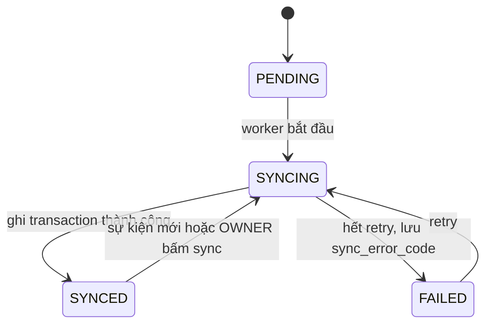
```mermaid
stateDiagram-v2
    [*] --> PENDING
    PENDING --> SYNCING: worker bắt đầu
    SYNCING --> SYNCED: ghi transaction thành công
    SYNCING --> FAILED: hết retry, lưu sync_error_code
    SYNCED --> SYNCING: sự kiện mới hoặc OWNER bấm sync
    FAILED --> SYNCING: retry
```

### Repository (✅)

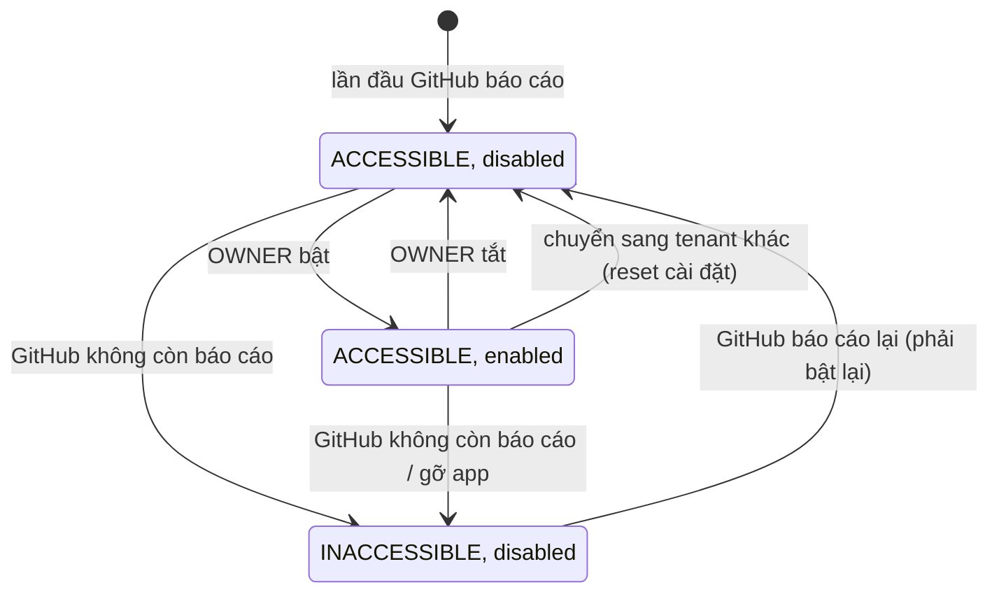
```mermaid
stateDiagram-v2
    state "ACCESSIBLE, disabled" as AD
    state "ACCESSIBLE, enabled" as AE
    state "INACCESSIBLE, disabled" as ID
    [*] --> AD: lần đầu GitHub báo cáo
    AD --> AE: OWNER bật
    AE --> AD: OWNER tắt
    AD --> ID: GitHub không còn báo cáo
    AE --> ID: GitHub không còn báo cáo / gỡ app
    ID --> AD: GitHub báo cáo lại (phải bật lại)
    AE --> AD: chuyển sang tenant khác (reset cài đặt)
```

Ràng buộc CHECK trong DB: `review_enabled = false OR status = 'ACCESSIBLE'` → **không thể** có repo vừa inaccessible vừa enabled.

### Trạng thái hiển thị (FR-041), suy ra từ cột DB

| Hiển thị | Điều kiện |
|----------|-----------|
| *Setting up* | `status=ACTIVE`, `sync_status ∈ {PENDING, SYNCING}`, `last_synced_at IS NULL` |
| *Active* | `status=ACTIVE`, `sync_status=SYNCED`, không có `sync_error_code` |
| *Active – synchronization failed* | `status=ACTIVE`, `sync_status=FAILED`; lý do: `GITHUB_UNAVAILABLE`, `GITHUB_RATE_LIMITED`, `ACCESS_REVOKED`, `OTHER` |
| *Active – repository limit reached* | `status=ACTIVE`, `sync_status=SYNCED`, `sync_error_code=REPOSITORY_LIMIT_EXCEEDED` |
| *Suspended* | `status=SUSPENDED` |
| *Removed* | `status=REMOVED` |

## 2.6 Bất biến quan trọng (invariants)

1. **Eligibility** — repo chỉ được review khi: `repositories.status = 'ACCESSIBLE' AND review_enabled AND github_installations.status = 'ACTIVE'`. Đọc trực tiếp mỗi lần, **không cache** (FR-022, SC-008).
2. **Một chủ** — một repo thuộc đúng một organization và một installation; `repositories.organization_id` phải bằng org của installation (FR-013).
3. **GitHub là nguồn sự thật** cho trạng thái GitHub; DB là bản chiếu (ERD §18). Review, finding, usage, audit là dữ liệu CodeLens sở hữu.
4. **Không có văn bản lỗi từ GitHub** trong DB, chỉ mã lỗi.
5. **Không có bí mật** trong DB (chỉ ciphertext hoặc tham chiếu), log, audit, prompt, frontend.
6. 🧭 **Idempotency review** — `review_jobs.idempotency_key` UNIQUE; job cũ không được đăng finding lên commit mới hơn.

---

# 3. API / Interface

## 3.1 Tổng quan các mặt giao tiếp

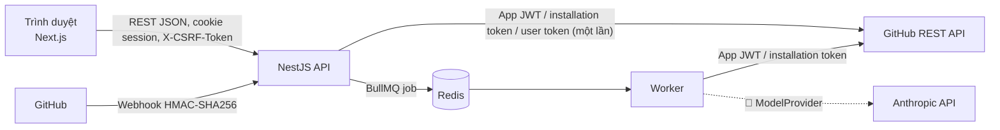
```mermaid
flowchart LR
    Browser["Trình duyệt<br/>Next.js"] -->|"REST JSON, cookie session, X-CSRF-Token"| API
    GitHub -->|"Webhook HMAC-SHA256"| API
    API["NestJS API"] -->|"BullMQ job"| Q[("Redis")]
    Q --> W["Worker"]
    API -->|"App JWT / installation token / user token (một lần)"| GHAPI["GitHub REST API"]
    W -->|"App JWT / installation token"| GHAPI
    W -.->|"🧭 ModelProvider"| LLM["Anthropic API"]
```

| Giao diện | Giao thức | Xác thực |
|-----------|-----------|----------|
| Web API (`/api/*`) | REST/JSON, cùng origin qua Nginx | Cookie `codelens_session` (httpOnly, Secure, SameSite=Lax) + `X-CSRF-Token` cho thao tác thay đổi trạng thái |
| Webhook (`/api/webhooks/github`) | HTTP POST từ GitHub | Chữ ký `X-Hub-Signature-256`, **không** dùng session |
| GitHub API (outbound) | REST qua Octokit | App JWT (đọc installation), installation token ngắn hạn (liệt kê repo), user token ngắn hạn chỉ lúc đăng nhập/xác nhận |
| Hàng đợi | BullMQ trên Redis | Nội bộ |
| LLM (🧭) | HTTPS qua `ModelProvider` | API key của CodeLens hoặc BYOK |

## 3.2 REST API — Feature 001 (✅)

Hợp đồng đầy đủ: [contracts/api.openapi.yaml](../../specs/001-github-app-onboarding/contracts/api.openapi.yaml). Base path `/api`.

| Method | Path | Mô tả | Quyền | Mã trả về chính |
|--------|------|-------|-------|-----------------|
| GET | `/auth/github/login` | Chuyển sang GitHub để đăng nhập | Công khai | 302 |
| GET | `/auth/github/callback` | Hoàn tất đăng nhập, tạo/dùng lại tài khoản, đặt cookie | Công khai (kiểm tra `state`) | 302 |
| POST | `/auth/logout` | Hủy session phía server | Session + CSRF | 204 |
| GET | `/me` | User hiện tại, danh sách org + vai trò, `csrfToken` | Session | 200, 401 |
| GET | `/me/refresh-access` | Đi qua GitHub authorization lại để đọc lại installation và vai trò | Session | 302 |
| GET | `/installations/new` | Chuyển sang trang cài app với `state` dùng một lần | Session | 302 |
| GET | `/installations/callback` | Setup callback; chỉ liên kết sau khi GitHub xác nhận | Session + `state` | 302, 400, 404 |
| GET | `/installations` | Installation trong các org của người gọi | MEMBER+ | 200 |
| GET | `/installations/{id}` | Chi tiết một installation | MEMBER+ | 200, 404 |
| GET | `/installations/{id}/repositories?q&state&cursor&limit` | Danh sách repo: tìm theo tên, lọc trạng thái, phân trang cursor (≤ 100) | MEMBER+ | 200, 404 |
| POST | `/installations/{id}/sync` | Chạy lại đồng bộ; an toàn khi gọi lặp | OWNER, vai trò xác nhận ≤ 10 phút | 202 `QUEUED \| ALREADY_QUEUED`, 403, 404, 409, 503 |
| PUT | `/repositories/{id}/review-enabled` | Body `{ "enabled": bool }`; idempotent | OWNER, vai trò xác nhận ≤ 10 phút | 200, 403, 404, 409, 503 |
| POST | `/webhooks/github` | Nhận webhook | Chữ ký HMAC | 202, 400, 401 |

**Quy ước lỗi** (`{ "code": string, "message": string }`):

| HTTP | `code` | Khi nào |
|------|--------|---------|
| 401 | `UNAUTHENTICATED` | Không có session hợp lệ; hoặc webhook sai/thiếu chữ ký (body không nói lý do) |
| 403 | `FORBIDDEN` | Không phải OWNER |
| 403 | `REAUTH_REQUIRED` | OWNER nhưng xác nhận vai trò cũ hơn 10 phút → client đi qua GitHub rồi thử lại |
| 404 | `NOT_FOUND` | Không tồn tại **hoặc thuộc tenant khác** — hai trường hợp trả về **giống hệt nhau** (FR-020) |
| 409 | — | Installation không ACTIVE, hoặc bật repo INACCESSIBLE |
| 503 | `ROLE_UNVERIFIABLE` | GitHub không xác nhận được vai trò; không thay đổi gì, không tin vai trò đã lưu |

**Mẫu dữ liệu `Installation`:**

```json
{
  "id": "5b0c…-uuid",
  "status": "ACTIVE",
  "syncStatus": "SYNCED",
  "syncErrorCode": null,
  "displayState": "ACTIVE",
  "repositorySelection": "SELECTED",
  "installedAt": "2026-09-30T08:00:00Z",
  "lastSyncedAt": "2026-09-30T08:00:12Z",
  "repositoryCount": 3,
  "organization": { "id": "…", "login": "acme", "accountType": "ORGANIZATION" },
  "githubSettingsUrl": "https://github.com/organizations/acme/settings/installations/123",
  "canManage": true
}
```

Lưu ý: `id` là **UUID của CodeLens**, không phải GitHub installation ID — client không bao giờ thao tác bằng ID GitHub.

## 3.3 Webhook contract (✅)

Hợp đồng: [contracts/webhooks.md](../../specs/001-github-app-onboarding/contracts/webhooks.md).

| Event / action | Tác dụng |
|----------------|----------|
| `installation` / `created` | Enqueue `reconcile` → upsert org + installation → sync. Audit `GITHUB_INSTALLATION_ADDED` một lần |
| `installation` / `deleted` | Enqueue `reconcile`; GitHub trả not found ⇒ REMOVED, mọi repo inaccessible + disabled. Audit `GITHUB_INSTALLATION_REMOVED` |
| `installation` / `suspend`, `unsuspend` | Reconcile trạng thái; audit mỗi lần chuyển trạng thái |
| `installation_repositories` / `added`, `removed` | Enqueue `sync` |
| `repository` / `renamed`, `transferred`, `publicized`, `privatized`, `deleted` | Enqueue `sync` |
| Sự kiện khác | Ghi `IGNORED`, trả 202 |
| 🧭 `pull_request` / `opened`, `synchronize`, `reopened` | Tạo ReviewJob (feature review) |
| 🧭 `issue_comment` chứa `/review` | Review thủ công |
| 🧭 `issues` / `opened` | Issue analysis |
| 🧭 `marketplace_purchase` | Cập nhật subscription |

**Nguyên tắc cốt lõi:** handler **không bao giờ sao chép trạng thái từ payload**. Payload chỉ cung cấp installation ID; trạng thái thật luôn đọc lại từ GitHub.

## 3.4 Hợp đồng hàng đợi (✅)

| Queue | Job ID | Dữ liệu | Retry |
|-------|--------|---------|-------|
| `reconcile-installation` | `reconcile-<githubInstallationId>` (và `…-rerun`) | `{ githubInstallationId, deliveryGuid? }` | 5 lần, exponential backoff (mặc định 5 s) |
| `sync-repositories` | `sync-<githubInstallationId>` (và `…-rerun`) | như trên | như trên |

Quy tắc gộp job (không bao giờ mất thay đổi):

- Không có job → thêm mới → `QUEUED`.
- Có job đang **chờ** → `ALREADY_QUEUED` (khi chạy, nó sẽ đọc trạng thái mới nhất).
- Có job đang **chạy** → thêm đúng **một** job `-rerun` để bắt các thay đổi đến sau khi job bắt đầu.

## 3.5 Interface nội bộ

### ✅ Đã có

```ts
// Ngữ cảnh ủy quyền — bắt buộc cho mọi truy vấn dữ liệu tenant (Principle III)
interface AuthorizationContext {
  userId: string;
  memberships: { organizationId: string; role: 'OWNER' | 'MEMBER'; roleVerifiedAt: Date | null }[];
}

// Quy tắc duy nhất về điều kiện review (FR-022) — mọi feature review sau này PHẢI gọi
interface ReviewEligibilityService {
  isReviewEligible(repositoryId: string): Promise<boolean>;
}

// Trừu tượng bí mật, cho phép chuyển sang AWS Secrets Manager (ADR-008)
interface SecretProvider {
  get(name: 'GITHUB_APP_PRIVATE_KEY' | 'GITHUB_WEBHOOK_SECRET' | 'GITHUB_APP_CLIENT_SECRET' | 'SESSION_SECRET'): Promise<string>;
}

// Client GitHub chỉ đọc
interface GithubAppClient {
  getInstallation(githubInstallationId: number): Promise<GithubInstallationInfo | null>; // null = đã gỡ
  listInstallationRepositories(githubInstallationId: number, limit: number):
    Promise<{ repositories: GithubRepositoryInfo[]; truncated: boolean }>;
}
```

### 🧭 Baseline cho review engine (ADR-004, ADR-005, ADR-014) — chữ ký 💡 đề xuất

```ts
type ReviewTask = 'PR_SUMMARY' | 'CODE_REVIEW' | 'SECURITY_REVIEW'
                | 'ARCHITECTURE_REVIEW' | 'ISSUE_ANALYSIS' | 'PR_CHAT';

interface ModelProvider {                      // AnthropicProvider, OpenAIProvider, GoogleProvider
  readonly id: string;
  generateStructured<T>(req: {
    model: string;
    system: string;                            // chỉ chỉ dẫn hệ thống + chính sách
    rules: string;                             // luật review đã resolve
    untrustedContent: DelimitedContent[];      // code, PR text… luôn là DỮ LIỆU
    schema: JsonSchema;                        // ép output có cấu trúc
  }): Promise<{ output: T; usage: { inputTokens: number; outputTokens: number }; latencyMs: number }>;
}

interface ModelRouter {
  resolve(ctx: { organizationId: string; profileId: string; task: ReviewTask }):
    Promise<{ provider: ModelProvider; modelConfigId: string; modelName: string }>;
}

interface StaticAnalyzer {                     // ESLint, Semgrep, PMD…
  supports(language: string): boolean;
  analyze(files: ChangedFile[]): Promise<RawFinding[]>;
}

interface GithubPublisher {                    // chỉ ghi comment/review, không gì khác
  publish(review: ValidatedReview, expectedHeadSha: string): Promise<PublishResult>;
}
```

### 🧭 Output AI có cấu trúc (ADR-005)

```json
{
  "summary": "…",
  "findings": [
    {
      "severity": "HIGH",
      "category": "SECURITY",
      "file": "src/PaymentService.java",
      "line": 124,
      "title": "Potential duplicate payment processing",
      "description": "…",
      "suggestion": "…",
      "confidence": 0.94
    }
  ]
}
```

### 🧭 `.codelens.yml` (ADR-007)

```yaml
version: 1
review:
  enabled: true
  profile: backend
  severity: { minimum: medium }
rules: { security: true, performance: true, architecture: true, testing: true }
paths:
  include: ["src/**"]
  exclude: ["**/generated/**", "**/target/**"]
models:
  tasks: { pr_summary: claude-haiku, code_review: claude-sonnet, security_review: claude-sonnet }
```

### 💡 API đề xuất cho các phase sau (chưa có trong spec)

| Method | Path | Mục đích |
|--------|------|----------|
| GET | `/repositories/{id}/reviews` | Lịch sử review của repo |
| GET | `/reviews/{id}` | Chi tiết review, model runs, findings |
| PATCH | `/findings/{id}` | Đánh dấu DISMISSED / FALSE_POSITIVE |
| GET/POST/DELETE | `/organizations/{id}/model-providers` | Quản lý provider + BYOK (key chỉ ghi, không bao giờ đọc lại) |
| GET/PUT | `/organizations/{id}/model-routes` | Định tuyến tác vụ → model |
| GET/PUT | `/organizations/{id}/review-profiles` | Profile + rules |
| GET | `/organizations/{id}/usage?from&to` | Token, chi phí, số review |

---

# 4. Data Workflow

## 4.1 Đăng nhập bằng GitHub (✅)

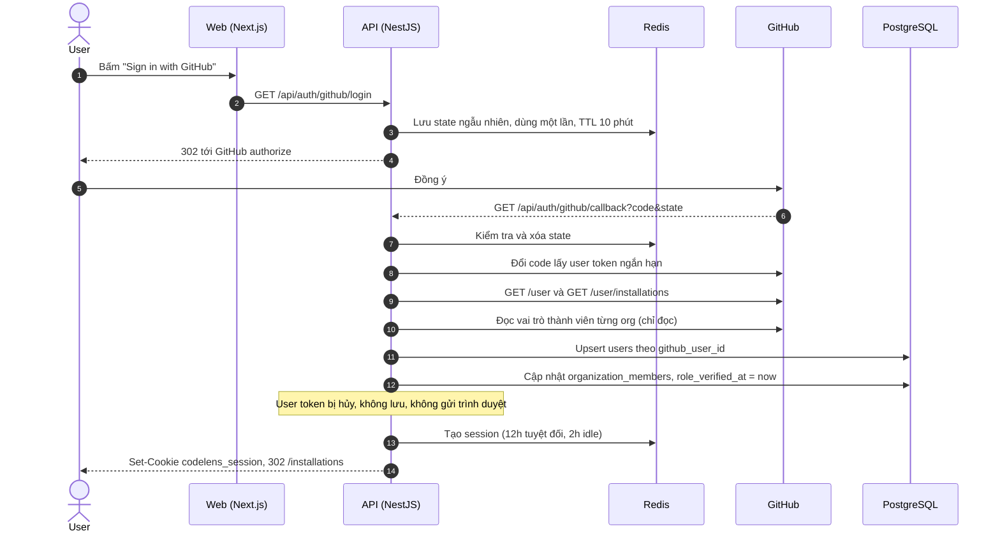
```mermaid
sequenceDiagram
    autonumber
    actor U as User
    participant W as Web (Next.js)
    participant A as API (NestJS)
    participant R as Redis
    participant G as GitHub
    participant DB as PostgreSQL

    U->>W: Bấm "Sign in with GitHub"
    W->>A: GET /api/auth/github/login
    A->>R: Lưu state ngẫu nhiên, dùng một lần, TTL 10 phút
    A-->>U: 302 tới GitHub authorize
    U->>G: Đồng ý
    G-->>A: GET /api/auth/github/callback?code&state
    A->>R: Kiểm tra và xóa state
    A->>G: Đổi code lấy user token ngắn hạn
    A->>G: GET /user và GET /user/installations
    A->>G: Đọc vai trò thành viên từng org (chỉ đọc)
    A->>DB: Upsert users theo github_user_id
    A->>DB: Cập nhật organization_members, role_verified_at = now
    Note over A: User token bị hủy, không lưu, không gửi trình duyệt
    A->>R: Tạo session (12h tuyệt đối, 2h idle)
    A-->>U: Set-Cookie codelens_session, 302 /installations
```

## 4.2 Cài GitHub App và setup callback (✅)

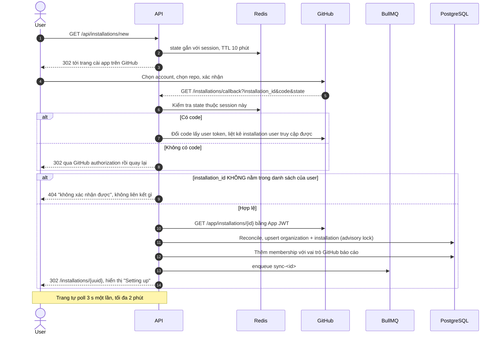
```mermaid
sequenceDiagram
    autonumber
    actor U as User
    participant A as API
    participant R as Redis
    participant G as GitHub
    participant Q as BullMQ
    participant DB as PostgreSQL

    U->>A: GET /api/installations/new
    A->>R: state gắn với session, TTL 10 phút
    A-->>U: 302 tới trang cài app trên GitHub
    U->>G: Chọn account, chọn repo, xác nhận
    G-->>A: GET /installations/callback?installation_id&code&state
    A->>R: Kiểm tra state thuộc session này
    alt Có code
        A->>G: Đổi code lấy user token, liệt kê installation user truy cập được
    else Không có code
        A-->>U: 302 qua GitHub authorization rồi quay lại
    end
    alt installation_id KHÔNG nằm trong danh sách của user
        A-->>U: 404 "không xác nhận được", không liên kết gì
    else Hợp lệ
        A->>G: GET /app/installations/{id} bằng App JWT
        A->>DB: Reconcile, upsert organization + installation (advisory lock)
        A->>DB: Thêm membership với vai trò GitHub báo cáo
        A->>Q: enqueue sync-<id>
        A-->>U: 302 /installations/{uuid}, hiển thị "Setting up"
    end
    Note over U,A: Trang tự poll 3 s một lần, tối đa 2 phút
```

Webhook `installation.created` có thể đến **trước hoặc sau** callback — cả hai cùng gọi một thao tác reconcile idempotent nên thứ tự không quan trọng.

## 4.3 Nhận webhook (✅)

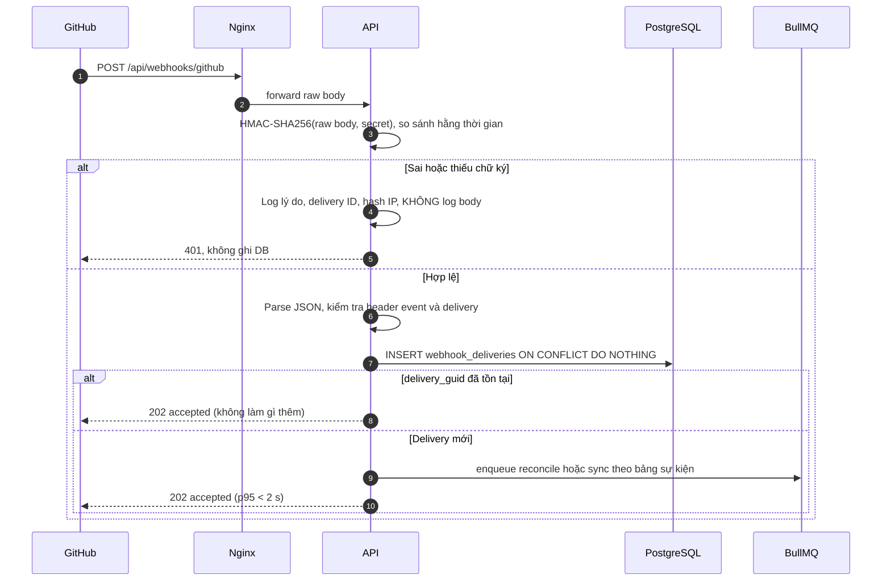
```mermaid
sequenceDiagram
    autonumber
    participant G as GitHub
    participant N as Nginx
    participant A as API
    participant DB as PostgreSQL
    participant Q as BullMQ

    G->>N: POST /api/webhooks/github
    N->>A: forward raw body
    A->>A: HMAC-SHA256(raw body, secret), so sánh hằng thời gian
    alt Sai hoặc thiếu chữ ký
        A->>A: Log lý do, delivery ID, hash IP, KHÔNG log body
        A-->>G: 401, không ghi DB
    else Hợp lệ
        A->>A: Parse JSON, kiểm tra header event và delivery
        A->>DB: INSERT webhook_deliveries ON CONFLICT DO NOTHING
        alt delivery_guid đã tồn tại
            A-->>G: 202 accepted (không làm gì thêm)
        else Delivery mới
            A->>Q: enqueue reconcile hoặc sync theo bảng sự kiện
            A-->>G: 202 accepted (p95 < 2 s)
        end
    end
```

## 4.4 Reconcile và đồng bộ repository (✅)

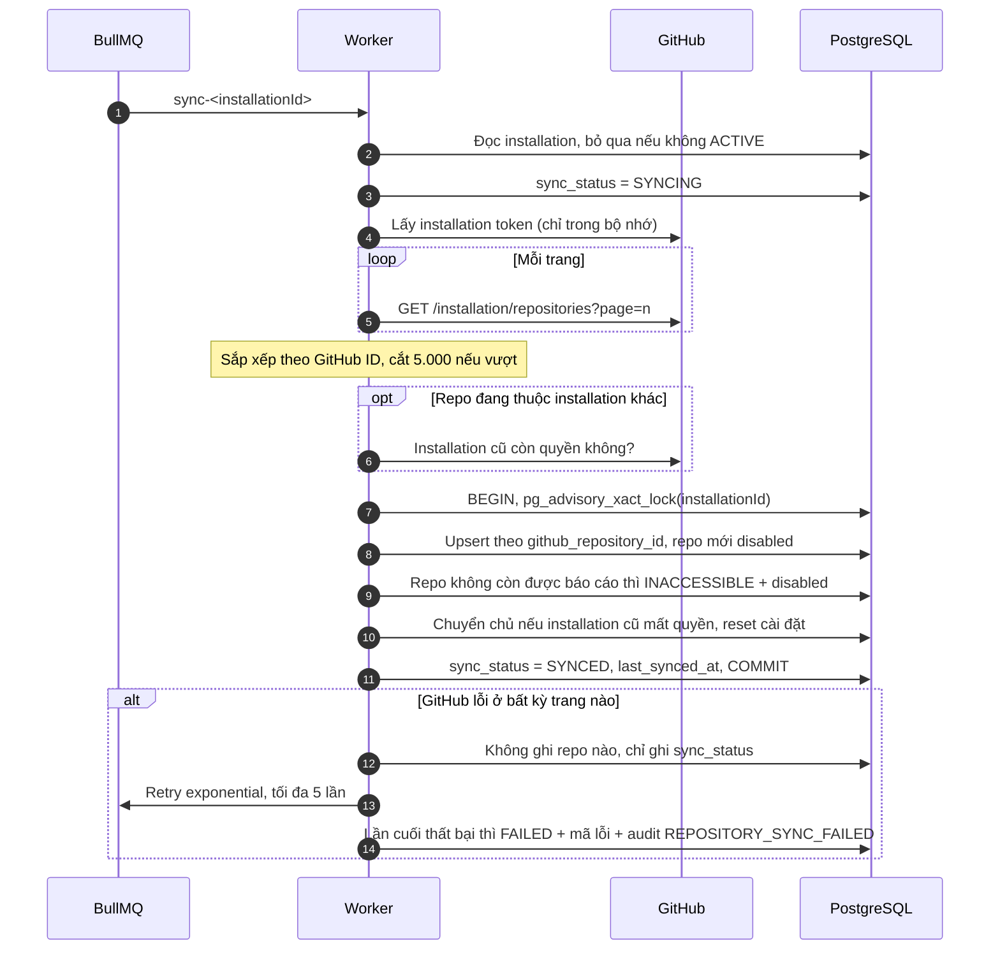
```mermaid
sequenceDiagram
    autonumber
    participant Q as BullMQ
    participant Wk as Worker
    participant G as GitHub
    participant DB as PostgreSQL

    Q->>Wk: sync-<installationId>
    Wk->>DB: Đọc installation, bỏ qua nếu không ACTIVE
    Wk->>DB: sync_status = SYNCING
    Wk->>G: Lấy installation token (chỉ trong bộ nhớ)
    loop Mỗi trang
        Wk->>G: GET /installation/repositories?page=n
    end
    Note over Wk: Sắp xếp theo GitHub ID, cắt 5.000 nếu vượt
    opt Repo đang thuộc installation khác
        Wk->>G: Installation cũ còn quyền không?
    end
    Wk->>DB: BEGIN, pg_advisory_xact_lock(installationId)
    Wk->>DB: Upsert theo github_repository_id, repo mới disabled
    Wk->>DB: Repo không còn được báo cáo thì INACCESSIBLE + disabled
    Wk->>DB: Chuyển chủ nếu installation cũ mất quyền, reset cài đặt
    Wk->>DB: sync_status = SYNCED, last_synced_at, COMMIT
    alt GitHub lỗi ở bất kỳ trang nào
        Wk->>DB: Không ghi repo nào, chỉ ghi sync_status
        Wk->>Q: Retry exponential, tối đa 5 lần
        Wk->>DB: Lần cuối thất bại thì FAILED + mã lỗi + audit REPOSITORY_SYNC_FAILED
    end
```

**Tại sao đọc GitHub *trước* transaction:** transaction ngắn, không giữ lock trong khi chờ mạng, và nếu đọc lỗi thì không có gì bị ghi dở (FR-017).

## 4.5 Bật/tắt review với kiểm tra độ tươi vai trò (✅)

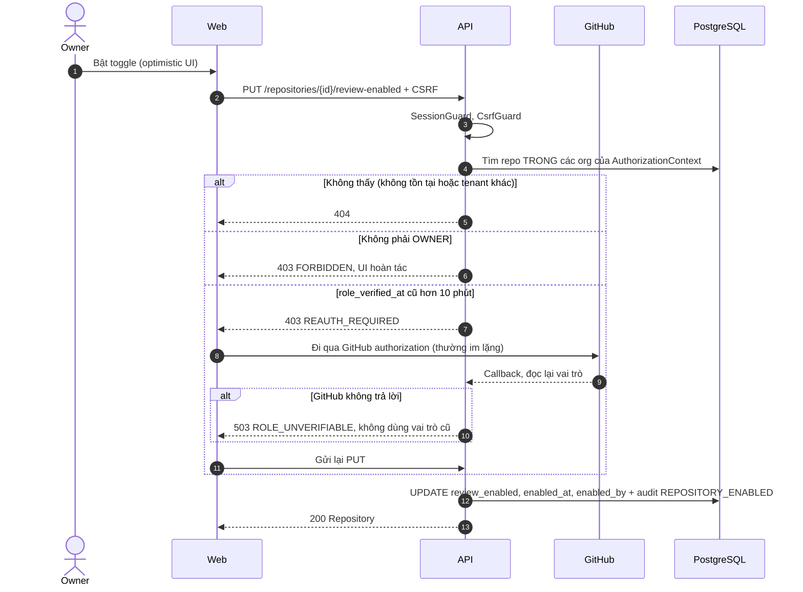
```mermaid
sequenceDiagram
    autonumber
    actor O as Owner
    participant W as Web
    participant A as API
    participant G as GitHub
    participant DB as PostgreSQL

    O->>W: Bật toggle (optimistic UI)
    W->>A: PUT /repositories/{id}/review-enabled + CSRF
    A->>A: SessionGuard, CsrfGuard
    A->>DB: Tìm repo TRONG các org của AuthorizationContext
    alt Không thấy (không tồn tại hoặc tenant khác)
        A-->>W: 404
    else Không phải OWNER
        A-->>W: 403 FORBIDDEN, UI hoàn tác
    else role_verified_at cũ hơn 10 phút
        A-->>W: 403 REAUTH_REQUIRED
        W->>G: Đi qua GitHub authorization (thường im lặng)
        G-->>A: Callback, đọc lại vai trò
        alt GitHub không trả lời
            A-->>W: 503 ROLE_UNVERIFIABLE, không dùng vai trò cũ
        end
        W->>A: Gửi lại PUT
    end
    A->>DB: UPDATE review_enabled, enabled_at, enabled_by + audit REPOSITORY_ENABLED
    A-->>W: 200 Repository
```

## 4.6 Gỡ cài đặt (✅)

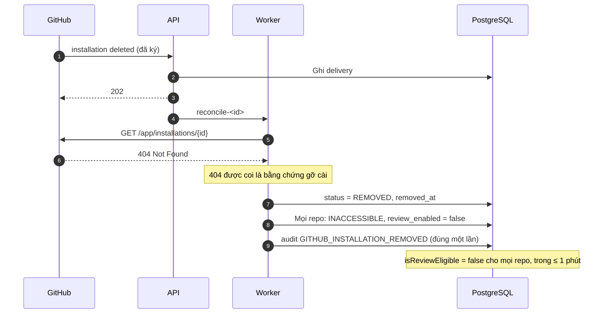
```mermaid
sequenceDiagram
    autonumber
    participant G as GitHub
    participant A as API
    participant Wk as Worker
    participant DB as PostgreSQL

    G->>A: installation deleted (đã ký)
    A->>DB: Ghi delivery
    A-->>G: 202
    A->>Wk: reconcile-<id>
    Wk->>G: GET /app/installations/{id}
    G-->>Wk: 404 Not Found
    Note over Wk: 404 được coi là bằng chứng gỡ cài
    Wk->>DB: status = REMOVED, removed_at
    Wk->>DB: Mọi repo: INACCESSIBLE, review_enabled = false
    Wk->>DB: audit GITHUB_INSTALLATION_REMOVED (đúng một lần)
    Note over DB: isReviewEligible = false cho mọi repo, trong ≤ 1 phút
```

## 4.7 Luồng review PR (🧭 Baseline — Phase 3/4)

Đây là luồng cốt lõi của sản phẩm theo ADR-005, 010, 011, 013, 014, 018. Chi tiết từng bước là 💡 đề xuất.

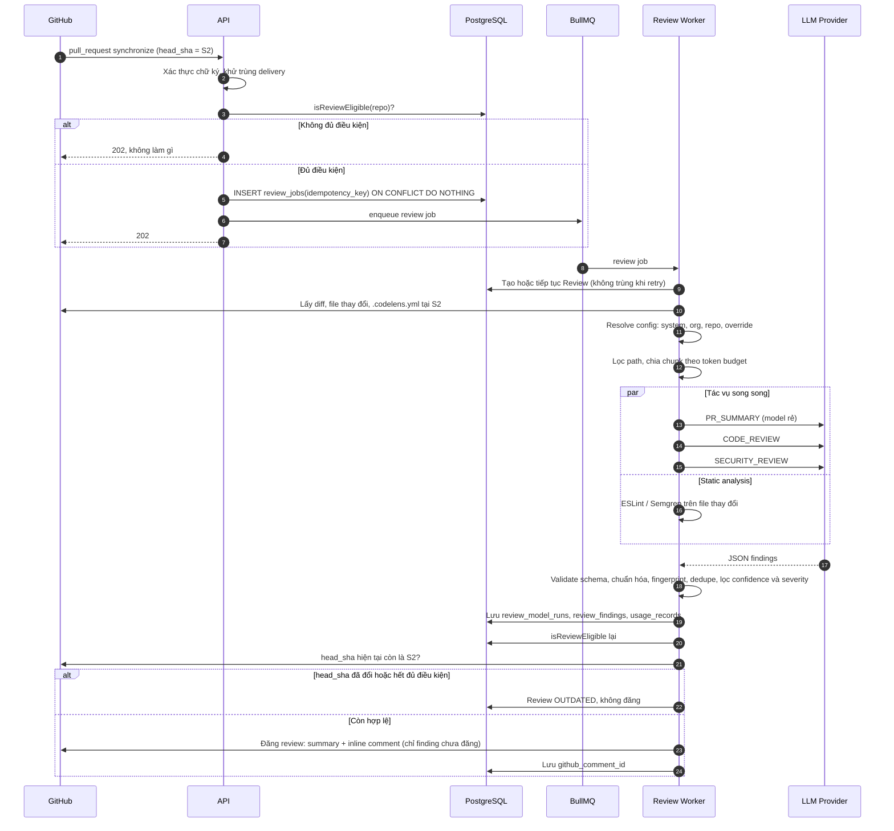
```mermaid
sequenceDiagram
    autonumber
    participant G as GitHub
    participant A as API
    participant DB as PostgreSQL
    participant Q as BullMQ
    participant Wk as Review Worker
    participant L as LLM Provider

    G->>A: pull_request synchronize (head_sha = S2)
    A->>A: Xác thực chữ ký, khử trùng delivery
    A->>DB: isReviewEligible(repo)?
    alt Không đủ điều kiện
        A-->>G: 202, không làm gì
    else Đủ điều kiện
        A->>DB: INSERT review_jobs(idempotency_key) ON CONFLICT DO NOTHING
        A->>Q: enqueue review job
        A-->>G: 202
    end
    Q->>Wk: review job
    Wk->>DB: Tạo hoặc tiếp tục Review (không trùng khi retry)
    Wk->>G: Lấy diff, file thay đổi, .codelens.yml tại S2
    Wk->>Wk: Resolve config: system, org, repo, override
    Wk->>Wk: Lọc path, chia chunk theo token budget
    par Tác vụ song song
        Wk->>L: PR_SUMMARY (model rẻ)
        Wk->>L: CODE_REVIEW
        Wk->>L: SECURITY_REVIEW
    and Static analysis
        Wk->>Wk: ESLint / Semgrep trên file thay đổi
    end
    L-->>Wk: JSON findings
    Wk->>Wk: Validate schema, chuẩn hóa, fingerprint, dedupe, lọc confidence và severity
    Wk->>DB: Lưu review_model_runs, review_findings, usage_records
    Wk->>DB: isReviewEligible lại
    Wk->>G: head_sha hiện tại còn là S2?
    alt head_sha đã đổi hoặc hết đủ điều kiện
        Wk->>DB: Review OUTDATED, không đăng
    else Còn hợp lệ
        Wk->>G: Đăng review: summary + inline comment (chỉ finding chưa đăng)
        Wk->>DB: Lưu github_comment_id
    end
```

---

# 5. High-level Design

## 5.1 Kiến trúc tổng thể (mục tiêu)

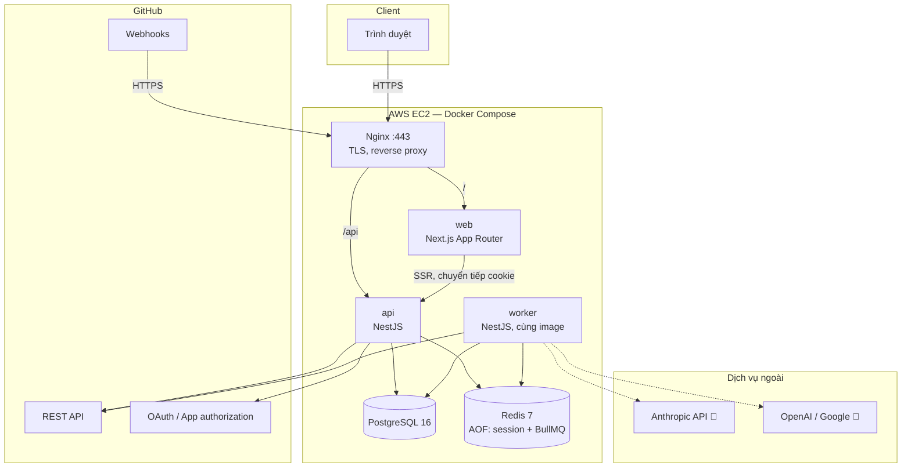
```mermaid
flowchart TB
    subgraph Client
        B["Trình duyệt"]
    end
    subgraph GitHubCloud["GitHub"]
        GHW["Webhooks"]
        GHA["REST API"]
        GHO["OAuth / App authorization"]
    end
    subgraph EC2["AWS EC2 — Docker Compose"]
        NG["Nginx :443<br/>TLS, reverse proxy"]
        WEB["web<br/>Next.js App Router"]
        API["api<br/>NestJS"]
        WK["worker<br/>NestJS, cùng image"]
        PG[("PostgreSQL 16")]
        RD[("Redis 7<br/>AOF: session + BullMQ")]
    end
    subgraph External["Dịch vụ ngoài"]
        ANT["Anthropic API 🧭"]
        OAI["OpenAI / Google 🧭"]
    end

    B -->|HTTPS| NG
    GHW -->|HTTPS| NG
    NG -->|"/"| WEB
    NG -->|"/api"| API
    WEB -->|"SSR, chuyển tiếp cookie"| API
    API --> PG
    API --> RD
    WK --> PG
    WK --> RD
    API --> GHA
    API --> GHO
    WK --> GHA
    WK -.-> ANT
    WK -.-> OAI
```

Nguyên tắc: **EC2 không chạy model**; LLM luôn là API bên ngoài (Roadmap §15), nên EC2 không cần GPU.

## 5.2 Module backend (✅ Feature 001)

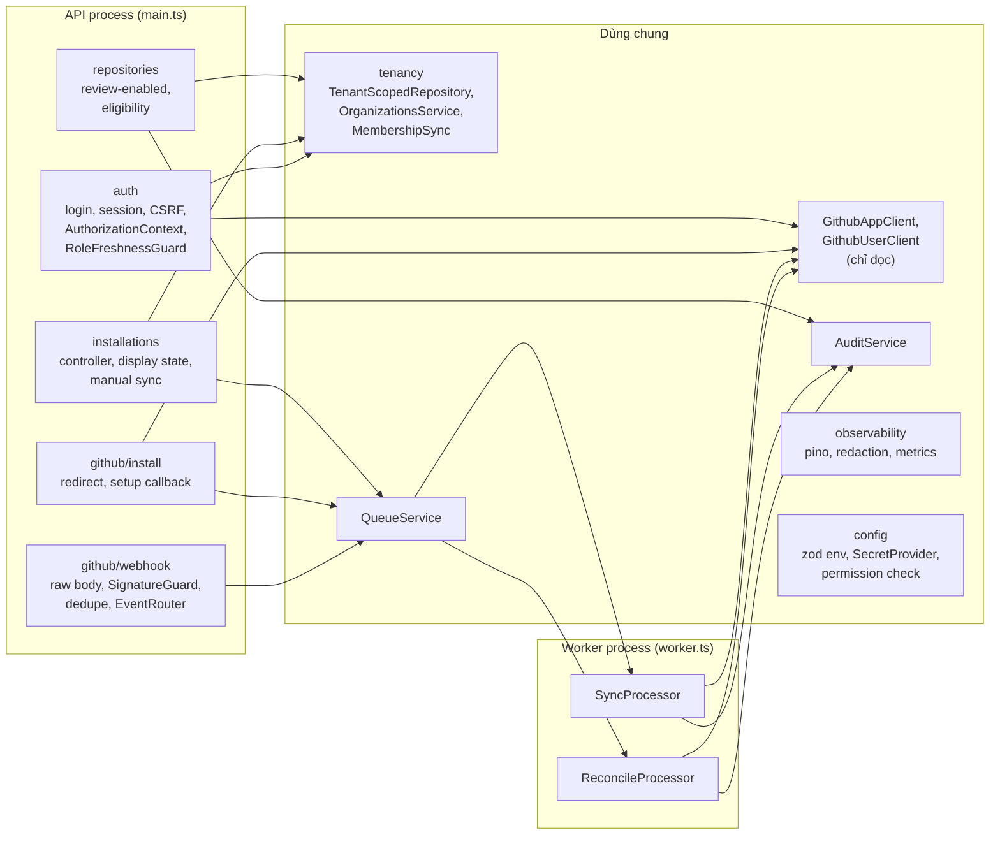
```mermaid
flowchart LR
    subgraph api["API process (main.ts)"]
        AUTH["auth<br/>login, session, CSRF,<br/>AuthorizationContext,<br/>RoleFreshnessGuard"]
        INST["github/install<br/>redirect, setup callback"]
        WH["github/webhook<br/>raw body, SignatureGuard,<br/>dedupe, EventRouter"]
        IC["installations<br/>controller, display state,<br/>manual sync"]
        RC["repositories<br/>review-enabled,<br/>eligibility"]
    end
    subgraph worker["Worker process (worker.ts)"]
        RP["ReconcileProcessor"]
        SP["SyncProcessor"]
    end
    subgraph shared["Dùng chung"]
        TEN["tenancy<br/>TenantScopedRepository,<br/>OrganizationsService,<br/>MembershipSync"]
        GHC["GithubAppClient,<br/>GithubUserClient<br/>(chỉ đọc)"]
        QS["QueueService"]
        AUD["AuditService"]
        OBS["observability<br/>pino, redaction, metrics"]
        CFG["config<br/>zod env, SecretProvider,<br/>permission check"]
    end

    WH --> QS
    INST --> QS
    IC --> QS
    QS --> RP
    QS --> SP
    AUTH --> TEN
    IC --> TEN
    RC --> TEN
    RP --> GHC
    SP --> GHC
    INST --> GHC
    AUTH --> GHC
    RP --> AUD
    SP --> AUD
    RC --> AUD
```

**API và worker dùng chung một codebase và một Docker image**, chỉ khác entry point → một backend để build, test, deploy (plan: Structure Decision).

Khi khởi động, API và worker **kiểm tra quyền của GitHub App**: nếu GitHub báo app có bất kỳ quyền ghi nào ngoài danh sách cho phép, tiến trình **từ chối khởi động** và log tên quyền đó (SC-014, `startup-refusal.spec.ts`).

### Xác thực backend → GitHub API: App JWT và installation access token (✅)

Backend gọi GitHub API bằng hai loại credential, cả hai chỉ nằm trong bộ nhớ của `GithubAppClient` ([github-app.client.ts](../../backend/src/github/github-app.client.ts)):

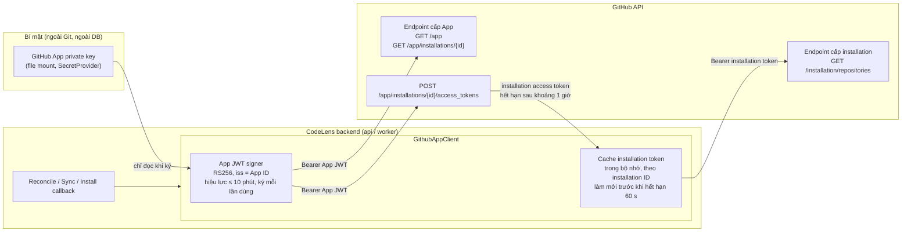
```mermaid
flowchart LR
    subgraph Secrets["Bí mật (ngoài Git, ngoài DB)"]
        PK["GitHub App private key<br/>(file mount, SecretProvider)"]
    end

    subgraph BE["CodeLens backend (api / worker)"]
        direction TB
        SVC["Reconcile / Sync / Install callback"]
        subgraph GHC["GithubAppClient"]
            JWT["App JWT signer<br/>RS256, iss = App ID<br/>hiệu lực ≤ 10 phút, ký mỗi lần dùng"]
            CACHE["Cache installation token<br/>trong bộ nhớ, theo installation ID<br/>làm mới trước khi hết hạn 60 s"]
        end
    end

    subgraph GH["GitHub API"]
        direction TB
        APPEP["Endpoint cấp App<br/>GET /app<br/>GET /app/installations/{id}"]
        TOKEP["POST /app/installations/{id}/access_tokens"]
        INSTEP["Endpoint cấp installation<br/>GET /installation/repositories"]
    end

    PK -->|"chỉ đọc khi ký"| JWT
    SVC --> GHC
    JWT -->|"Bearer App JWT"| APPEP
    JWT -->|"Bearer App JWT"| TOKEP
    TOKEP -->|"installation access token<br/>hết hạn sau khoảng 1 giờ"| CACHE
    CACHE -->|"Bearer installation token"| INSTEP
```

| Credential | Tạo bởi | Hiệu lực | Dùng để | Không bao giờ |
|-----------|---------|---------|--------|--------------|
| **App JWT** | Backend tự ký bằng private key (RS256, `iss` = App ID, `iat` lùi 30 s để bù lệch đồng hồ) | ≤ 10 phút | Hỏi GitHub về **chính app** (quyền, kiểm tra lúc khởi động) và về **installation** (trạng thái, đã gỡ chưa); đổi lấy installation token | Được lưu lại |
| **Installation access token** | GitHub cấp khi backend gửi App JWT tới `access_tokens` | Khoảng 1 giờ | Đọc dữ liệu **trong phạm vi một installation**: danh sách repo (🧭 sau này: diff, file, đăng comment khi có quyền) | Được ghi vào DB, Redis, log hoặc trả về trình duyệt (FR-034) |

- Token có phạm vi theo installation, nên dữ liệu của tenant này không thể đọc bằng token của tenant khác. Đây cũng là lý do installation ID là ranh giới ủy quyền (FR-009).
- Nếu GitHub trả 401 cho một installation token, token đó bị bỏ khỏi cache và lần thử sau sẽ xin token mới.
- Lời gọi `POST …/access_tokens` là bước đổi token bắt buộc của GitHub, **không** phải thao tác ghi lên repository; app vẫn chỉ có quyền đọc (FR-032).
- Luồng này tách biệt với **user-to-server token** dùng lúc đăng nhập (§4.1): token đó thay mặt người dùng, chỉ dùng một lần để xác nhận danh tính và quyền, rồi bị hủy.

## 5.3 Kiến trúc review engine (🧭 Baseline ADR-001, 004, 005, 014)

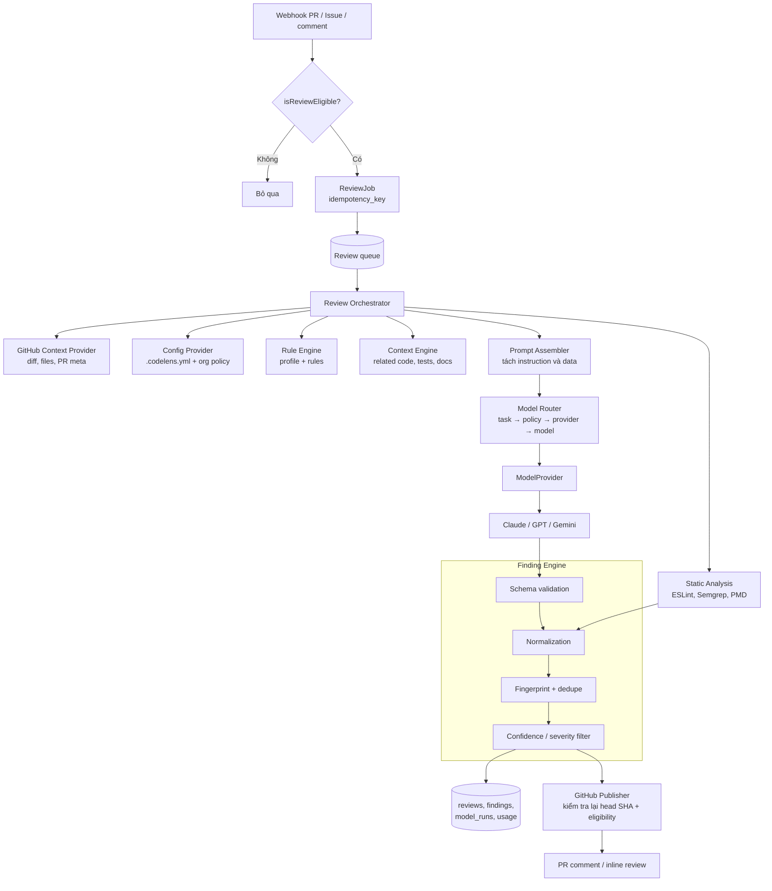
```mermaid
flowchart TB
    EV["Webhook PR / Issue / comment"] --> GATE{"isReviewEligible?"}
    GATE -->|Không| DROP["Bỏ qua"]
    GATE -->|Có| JOB["ReviewJob<br/>idempotency_key"]
    JOB --> QUEUE[("Review queue")]
    QUEUE --> ORCH["Review Orchestrator"]

    ORCH --> GCP["GitHub Context Provider<br/>diff, files, PR meta"]
    ORCH --> CFGP["Config Provider<br/>.codelens.yml + org policy"]
    ORCH --> RULE["Rule Engine<br/>profile + rules"]
    ORCH --> CTX["Context Engine<br/>related code, tests, docs"]
    ORCH --> SA["Static Analysis<br/>ESLint, Semgrep, PMD"]
    ORCH --> PA["Prompt Assembler<br/>tách instruction và data"]
    PA --> MR["Model Router<br/>task → policy → provider → model"]
    MR --> MP["ModelProvider"]
    MP --> LLM["Claude / GPT / Gemini"]
    LLM --> VAL

    subgraph FE["Finding Engine"]
        VAL["Schema validation"] --> NORM["Normalization"]
        NORM --> DEDUP["Fingerprint + dedupe"]
        DEDUP --> FILT["Confidence / severity filter"]
    end
    SA --> NORM
    FILT --> STORE[("reviews, findings,<br/>model_runs, usage")]
    FILT --> PUB["GitHub Publisher<br/>kiểm tra lại head SHA + eligibility"]
    PUB --> GH["PR comment / inline review"]
```

## 5.4 Triển khai (✅ ADR-015)

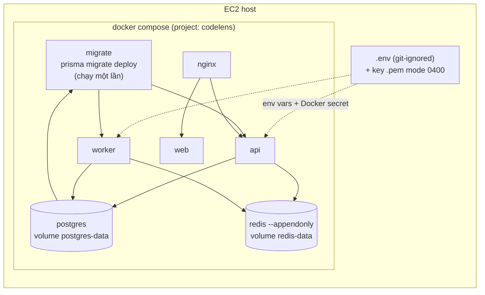
```mermaid
flowchart LR
    subgraph host["EC2 host"]
        ENV[".env (git-ignored)<br/>+ key .pem mode 0400"]
        subgraph compose["docker compose (project: codelens)"]
            direction TB
            MIG["migrate<br/>prisma migrate deploy<br/>(chạy một lần)"]
            PG[("postgres<br/>volume postgres-data")]
            RD[("redis --appendonly<br/>volume redis-data")]
            API["api"]
            WK["worker"]
            WEB["web"]
            NG["nginx"]
        end
    end
    ENV -.->|"env vars + Docker secret"| API
    ENV -.-> WK
    PG --> MIG
    MIG --> API
    MIG --> WK
    NG --> WEB
    NG --> API
    API --> PG
    API --> RD
    WK --> PG
    WK --> RD
```

- Migration được áp dụng **trước** khi API/worker khởi động; không sửa schema thủ công (Principle XIV).
- Private key của GitHub App được **mount read-only** qua Docker secret, không bao giờ nằm trong image hay Git.
- CI (`.github/workflows/`) chạy lint, build, test, và **secret scan** trên mã nguồn và artifact (SC-013).

## 5.5 Lựa chọn công nghệ và lý do

| Thành phần | Chọn | Lý do chính | Phương án khác |
|-----------|------|-------------|----------------|
| Backend | NestJS + TypeScript | Hệ sinh thái GitHub/AI SDK tốt, DI, guard, module rõ | Spring Boot (giữ cho dịch vụ throughput cao sau này) |
| Frontend | Next.js + React + Tailwind + shadcn/ui | SSR, App Router, UI nhanh | — |
| DB | PostgreSQL | Ràng buộc mạnh, advisory lock, JSONB, partial index | — |
| Queue | Redis + BullMQ | Retry, backoff, job ID xác định, concurrency | SQS (khi lên managed) |
| Session | Redis, cookie opaque | Thu hồi được ngay, không token ở JS | JWT (khó thu hồi), DB session |
| ORM | Prisma + SQL migration commit | Query có kiểu, SQL review được | TypeORM |
| Tích hợp | GitHub App | Quyền theo installation, webhook, Marketplace | OAuth App, GitHub Actions |
| Triển khai | Docker Compose, 1 EC2 | Chi phí và độ phức tạp thấp nhất | ECS/K8s (sau, có ADR) |

---

# 6. Deep dive & Scale

## 6.1 Webhook: idempotency, thứ tự và mô hình "reconcile từ GitHub" (✅)

**Vấn đề.** GitHub có thể gửi một delivery **nhiều lần**, **đồng thời**, **sai thứ tự** (ví dụ `installation_repositories.added` đến trước `installation.created`), hoặc **muộn** (sự kiện `suspend` cũ đến sau `unsuspend` mới). Nếu áp dụng payload như một delta, trạng thái cuối phụ thuộc thứ tự đến → sai.

**Giải pháp: 4 lớp.**

```mermaid
flowchart TB
    D["Delivery đến"] --> L1{"L1: delivery_guid UNIQUE<br/>INSERT ON CONFLICT"}
    L1 -->|Trùng| ACK1["202, dừng"]
    L1 -->|Mới| L2["L2: Job ID xác định<br/>reconcile-ID / sync-ID"]
    L2 --> L2a{"Job đang chờ?"}
    L2a -->|Có| ACK2["ALREADY_QUEUED<br/>(gộp)"]
    L2a -->|"Đang chạy"| RERUN["Thêm đúng 1 job -rerun"]
    L2a -->|Không| ADD["Thêm job"]
    ADD --> L3
    RERUN --> L3
    L3["L3: Handler đọc trạng thái THẬT từ GitHub<br/>(bỏ qua nội dung payload)"] --> L4["L4: pg_advisory_xact_lock(installationId)<br/>tuần tự hóa pha ghi"]
    L4 --> UPS["Upsert theo ID GitHub bất biến"]
```

| Lớp | Chống lại | Cơ chế |
|-----|-----------|--------|
| L1 | Redelivery của GitHub | `webhook_deliveries.delivery_guid` UNIQUE |
| L2 | Bão sự kiện cho cùng installation | Job ID xác định; gộp job đang chờ; một job `-rerun` nếu đang chạy |
| L3 | Sai thứ tự, đến muộn, payload cũ | Luôn đọc từ GitHub → hội tụ về trạng thái hiện tại bất kể thứ tự |
| L4 | Hai worker ghi cùng installation | Advisory lock theo `github_installation_id` trong transaction |

**Hệ quả:** hai delivery khác nhau với cùng nội dung vẫn được xử lý, nhưng lần thứ hai không đổi gì (SC-005, SC-006). Đánh đổi: tốn thêm lời gọi GitHub API cho mỗi sự kiện — chấp nhận được ở MVP; ở quy mô lớn giảm bằng việc gộp job (L2).

**Trường hợp đặc biệt — gỡ cài:** sau khi gỡ, GitHub trả 404 cho `GET /app/installations/{id}`. Reconcile coi 404 là bằng chứng gỡ cài có thẩm quyền → REMOVED. Nhờ vậy `deleted` đến trước `created` cũng hội tụ đúng.

## 6.2 Cô lập tenant (✅ Principle III)

```mermaid
flowchart LR
    REQ["Request"] --> SG["SessionGuard<br/>session Redis → userId"]
    SG --> AC["resolveAuthorizationContext<br/>memberships từ DB"]
    AC --> CTRL["Controller"]
    CTRL --> TSR["TenantScopedRepository<br/>WHERE organization_id IN ctx.orgs"]
    TSR --> PG[("PostgreSQL")]
    TSR -->|"Không có dòng"| NF["404 giống hệt 'không tồn tại'"]
```

Các biện pháp:

1. **Mọi** phương thức ở tầng repository yêu cầu `AuthorizationContext`; không có đường truy vấn "trần".
2. Tài nguyên tenant khác → **404, không phải 403** → không suy ra được sự tồn tại (FR-020). Áp dụng cả cho đếm, tìm kiếm, thông báo lỗi.
3. Công việc từ webhook/worker dùng `SystemContext` được ủy quyền bằng **installation ID**, luôn phân giải về đúng một organization (FR-009).
4. `sync_conflict` không bao giờ lộ qua API → tenant này không biết tenant kia đang dùng repo.
5. Kiểm thử âm: hai user ở hai org gọi ID của nhau → 404 hai chiều; toàn bộ ma trận FR-040 với 4 loại người gọi (`tenant-isolation.spec.ts`).
6. 🧭 Mở rộng cho review: queue job, cache, log và **prompt** cũng không được trộn dữ liệu tenant (Principle III). Mỗi prompt chỉ chứa dữ liệu của một repo.

💡 **Đề xuất phòng thủ nhiều lớp khi quy mô tăng:** bật PostgreSQL Row-Level Security với `SET LOCAL app.org_ids = …` trong mỗi transaction, để lỗi quên scope ở code vẫn bị DB chặn. Cần ADR vì thay đổi mô hình truy cập DB.

## 6.3 Xác thực, session và vai trò (✅)

| Quyết định | Lý do | Đánh đổi (Principle XVII) |
|-----------|-------|--------------------------|
| Đăng nhập bằng user authorization của **chính GitHub App** | Một tích hợp duy nhất; token giới hạn trong giao của quyền user và app | — |
| **Không lưu user token** | Không có credential sống lâu ở trạng thái nghỉ | Membership chỉ làm mới khi đăng nhập / "Refresh access" |
| Session opaque trong Redis, 12h tuyệt đối, 2h idle | Thu hồi được, không token trong JS | Người dùng phải đăng nhập lại thường hơn |
| Vai trò lấy từ GitHub, **không** từ người cài | Người cài có thể là app manager, không phải owner | Thêm lời gọi GitHub |
| Thao tác quản trị yêu cầu xác nhận ≤ 10 phút | Owner bị hạ quyền trên GitHub mất quyền tối đa sau 10 phút | Thỉnh thoảng phải xác nhận lại (thường im lặng) |
| GitHub không trả lời → **từ chối** (503) | Fail closed, không dùng vai trò cũ | GitHub sập thì không quản trị được (vẫn xem được) |
| `state` ngẫu nhiên, một lần, gắn session, TTL 10 phút | Chống CSRF trên OAuth và chống chiếm installation | — |
| Xác minh `installation_id` trong callback với GitHub | ID trên URL do người dùng kiểm soát | — |

**Chống chiếm installation của người khác:** kẻ tấn công sửa `installation_id` trong URL callback thành ID của tổ chức nạn nhân. CodeLens dùng user token ngắn hạn hỏi GitHub "user này truy cập được những installation nào?" — ID của nạn nhân không có trong đó → không liên kết, trả thông báo chung (US2-7).

**Gate G1 (còn mở):** quyền GitHub chỉ-đọc cần để xác nhận vai trò thành viên tổ chức phải được xác minh bằng spike trên app thật và ghi vào ADR-006 trước khi hoàn tất tác vụ T077/T092. Hiện bước "hỏi lại GitHub rồi áp dụng thay đổi" trong luồng REAUTH đang ở trạng thái *Partial* trong `quickstart.md`.

## 6.4 Thuật toán đồng bộ và chuyển nhượng repo (✅)

**Tính xác định:** khóa theo `github_repository_id` bất biến → rename cập nhật cùng dòng; chạy lại trên trạng thái không đổi → 0 thay đổi.

**Giới hạn 5.000:** sắp xếp theo GitHub ID tăng dần, lấy 5.000 đầu → **cùng một tập mỗi lần chạy**; repo từng có nhưng nằm ngoài tập → INACCESSIBLE; `sync_error_code = REPOSITORY_LIMIT_EXCEEDED`, UI cảnh báo.

**Chuyển nhượng / chồng lấn:**

```mermaid
flowchart TB
    S["Installation B báo cáo repo R<br/>đang thuộc installation A"] --> Q{"Hỏi GitHub:<br/>A còn quyền với R?"}
    Q -->|Không| MOVE["Chuyển R sang org/installation của B<br/>review_enabled = false<br/>xóa enabled_at, enabled_by<br/>audit cũ ở lại org A"]
    Q -->|Có| KEEP["A giữ R, B không liệt kê R<br/>sync_conflict = true<br/>log cảnh báo cho operator"]
    MOVE --> OK["Không tenant nào biết về tenant kia"]
    KEEP --> OK
```

**An toàn khi lỗi:** mọi trang được đọc xong **trước** khi mở transaction; lỗi ở bất kỳ trang nào → không ghi repo nào → `FAILED` với mã lỗi phân loại (`GITHUB_UNAVAILABLE`, `GITHUB_RATE_LIMITED`, `ACCESS_REVOKED`, `OTHER`), không bao giờ lưu văn bản lỗi thô của GitHub.

## 6.5 Bí mật và bề mặt tấn công (✅ Principle XI)

| Bí mật | Lưu ở đâu | Không bao giờ ở |
|--------|-----------|-----------------|
| GitHub App private key | File trên host, mode 0400, mount Docker secret | Git, image layer, log, DB |
| Webhook secret, client secret, session secret | Biến môi trường từ `.env` git-ignored | Git, frontend, log |
| Installation token | Bộ nhớ worker, hết hạn nhanh | DB, Redis, trình duyệt |
| User token | Bộ nhớ trong lúc đổi code, rồi hủy | Bất kỳ đâu khác |
| 🧭 BYOK API key | Ciphertext (envelope encryption) hoặc tham chiếu Secrets Manager | Prompt, response API, log |

Biện pháp bổ sung: danh sách redaction của pino (tên bí mật, header `Authorization`, `Cookie`); webhook bị từ chối chỉ log lý do + delivery ID + **hash IP**; secret scan trong CI trên mã nguồn và mọi artifact build; kiểm thử quét response/HTML/log tìm giá trị bí mật (`secret-leak-scan.spec.ts`).

💡 **Đề xuất cho BYOK (Phase 5):** mã hóa envelope — mỗi key được mã bằng data key (AES-256-GCM), data key được mã bằng master key nằm ngoài DB (KMS hoặc file bí mật trên host); `model_providers.credential_reference` chỉ trỏ tới bản mã. API chỉ cho **ghi** key và trả về 4 ký tự cuối, không bao giờ đọc lại.

## 6.6 Review engine — các điểm khó (🧭 Baseline, chi tiết 💡)

### a) Idempotency và commit cũ (ADR-011, Principle IX)

```text
idempotency_key = installation_id : repository_id : pr_number : head_sha : review_type : profile/config_version
```

- Mỗi commit mới → context review mới.
- 💡 Khi `synchronize` đến với SHA mới, **hủy mềm** job cũ chưa chạy xong của cùng PR (đánh dấu superseded) để tiết kiệm token.
- **Ngay trước khi đăng**, đọc lại `head_sha` từ GitHub và gọi lại `isReviewEligible`; nếu đã đổi → Review `OUTDATED`, không đăng (Principle IX). Điều này cũng xử lý trường hợp repo bị tắt trong khi review đang chạy (spec Assumptions).

### b) Output có cấu trúc (ADR-005, Principle VII)

```mermaid
flowchart LR
    LLM["LLM output"] --> P{"Parse JSON<br/>theo schema zod"}
    P -->|Lỗi| RETRY["Retry có giới hạn<br/>kèm lỗi validate"]
    RETRY --> P
    P -->|"Lỗi sau N lần"| REJ["Bỏ, ghi model_run FAILED<br/>KHÔNG BAO GIỜ đăng"]
    P -->|OK| V["Kiểm tra ngữ nghĩa:<br/>file có trong diff? dòng hợp lệ?"]
    V --> N["Chuẩn hóa severity, category, path"]
    N --> F["Fingerprint"]
    F --> DD["Dedupe với finding đã đăng"]
    DD --> CF["Lọc confidence và severity tối thiểu"]
    CF --> PUB["Publisher"]
```

Kiểm tra "file và dòng nằm trong diff" chặn ảo giác vị trí và cũng là lý do GitHub từ chối inline comment.

### c) Fingerprint và dedupe (ERD §11, open item trong Constitution)

ERD gợi ý fingerprint từ repository + PR + commit + file + dòng + category + finding đã chuẩn hóa. 💡 Đề xuất:

- **Không** đưa `commit` và số dòng tuyệt đối vào fingerprint dùng để dedupe giữa các lần review, vì code dịch chuyển làm đổi dòng → finding cũ bị đăng lại. Thay vào đó dùng: `repo_id + file_path + category + hash(đoạn code chuẩn hóa quanh dòng) + hash(tiêu đề chuẩn hóa)`.
- Index `(review_id)` và index không-unique `(fingerprint)`; UNIQUE `(pull_request_id, fingerprint)` trên bảng "finding đã đăng" để publisher idempotent.
- Đây là quyết định còn mở trong ERD §16 → cần ADR trước khi hiện thực.

### d) Chống prompt injection (ADR-018, Principle IV)

- Prompt gồm các phần **tách biệt**: system instructions → chính sách ứng dụng → luật review → cấu hình repo → nội dung repo. Nội dung repo luôn nằm trong khối phân định rõ là **dữ liệu**.
- `.codelens.yml` là dữ liệu không tin cậy: chỉ được **thu hẹp** chính sách tổ chức, không nới lỏng (ADR-007).
- Output chỉ có thể là JSON theo schema → kể cả khi model bị "thuyết phục", nó không thể gọi thao tác nào; publisher chỉ biết đăng comment.
- App không có quyền ghi Contents/Workflows/Administration → giới hạn thiệt hại tối đa là một comment sai.

### e) Diff lớn và giới hạn token

💡 Chiến lược: lọc theo `paths.include/exclude` và file sinh tự động → xếp hạng file theo rủi ro (kích thước thay đổi, loại file, luật) → chia chunk theo token budget của model → review song song từng chunk → gộp finding. Vượt ngân sách của tenant → review một phần và ghi rõ trong summary.

## 6.7 Quan sát được (✅ Feature 001, 🧭 review)

| Tín hiệu | Nội dung |
|----------|---------|
| Log (pino JSON) | `deliveryId`, `githubInstallationId`, `jobId`, `organizationId`, 🧭 `reviewId`; không body webhook, không nội dung repo |
| Counter ✅ | Delivery nhận / bị từ chối / trùng; sync hoàn tất / thất bại |
| Histogram ✅ | Thời gian sync |
| 🧭 Review | Độ trễ review, độ trễ LLM, token in/out, chi phí ước tính, số finding, số lỗi, số retry (ADR-019) |
| Audit | `GITHUB_INSTALLATION_ADDED/REMOVED/SUSPENDED/UNSUSPENDED`, `REPOSITORY_ENABLED/DISABLED`, `REPOSITORY_SYNC_FAILED` |

💡 SLO đề xuất: webhook ACK p95 < 2 s; onboarding p95 < 30 s; review PR p95 < 5 phút từ khi push; tỉ lệ review thất bại < 1%.

## 6.8 Chiến lược scale

### Nút thắt theo thứ tự xuất hiện

| # | Nút thắt | Triệu chứng | Giải pháp |
|---|---------|-------------|-----------|
| 1 | **Rate limit LLM provider** (token/phút) | 429, review chậm | Token bucket theo provider + theo tenant trong Redis; hàng đợi ưu tiên; fallback model theo `priority` của `model_task_routes`; BYOK chuyển giới hạn sang key của khách |
| 2 | **Rate limit GitHub API** theo installation | 403/429 secondary rate limit | Gộp job (đã có), ETag/conditional request, backoff theo header `Retry-After`, cache metadata PR ngắn hạn |
| 3 | **Worker concurrency** | Hàng đợi dài giờ cao điểm | Worker scale ngang (stateless); tách queue theo loại việc; concurrency theo queue |
| 4 | **Tenant ồn ào** | Một org lớn chiếm hết worker | Giới hạn review đồng thời theo org (BullMQ group/rate limit), fair scheduling |
| 5 | **Kết nối PostgreSQL** | Hết connection khi nhiều worker | PgBouncer (transaction pooling); lưu ý advisory lock dạng `xact` tương thích transaction pooling |
| 6 | **Bảng tăng nhanh** | Query chậm, vacuum nặng | Partition theo tháng cho `webhook_deliveries`, `audit_logs`, `usage_records`; chính sách lưu trữ (feature riêng) |
| 7 | **Đọc dashboard** | Tải đọc cao | Read replica; bảng tổng hợp usage theo ngày |
| 8 | **Diff/context lớn** | Redis/DB phình | Lưu artifact lớn ở S3, DB chỉ giữ tham chiếu |

### Lộ trình kiến trúc theo giai đoạn

> Mọi bước vượt quá Stage 0 đều đưa thêm hạ tầng → **bắt buộc có ADR** trước (Principle XVI, ADR-015).

```mermaid
flowchart LR
    S0["<b>Stage 0 — MVP</b><br/>1 EC2, Compose<br/>Nginx, web, api, worker,<br/>Postgres, Redis"]
    S1["<b>Stage 1 — Tách dữ liệu</b><br/>RDS Postgres + backup<br/>ElastiCache Redis<br/>Secrets Manager<br/>2+ EC2 sau ALB"]
    S2["<b>Stage 2 — Tách tải</b><br/>Worker fleet riêng theo queue<br/>Autoscaling theo độ dài queue<br/>PgBouncer, read replica<br/>S3 cho artifact"]
    S3["<b>Stage 3 — Quy mô lớn</b><br/>SQS/EventBridge cho ingest<br/>Partition bảng lớn<br/>Vector store cho codebase intelligence<br/>Tách service throughput cao"]
    S0 -->|"Có user thật, cần HA"| S1
    S1 -->|"Queue dài, LLM đồng thời cao"| S2
    S2 -->|"Hàng nghìn org"| S3
```

### Kiến trúc Stage 2 (💡 đề xuất)

```mermaid
flowchart TB
    GH["GitHub"] --> ALB["ALB / Nginx"]
    U["Users"] --> ALB
    ALB --> API1["api x N<br/>stateless"]
    ALB --> WEB1["web x N"]
    API1 -->|"Chỉ ghi delivery + enqueue"| RQ[("Redis / ElastiCache")]
    RQ --> QI["queue: reconcile + sync"]
    RQ --> QR["queue: review<br/>rate limit theo org"]
    RQ --> QP["queue: publish"]
    QI --> WI["worker-integration x M"]
    QR --> WR["worker-review x K<br/>autoscale theo backlog"]
    QP --> WP["worker-publisher x P"]
    WR --> TB["Token bucket<br/>theo provider / tenant"]
    TB --> LLM["LLM providers"]
    WI --> PGB["PgBouncer"]
    WR --> PGB
    WP --> PGB
    API1 --> PGB
    PGB --> PGP[("Postgres primary")]
    PGP --> PGR[("Read replica")]
    API1 -.->|"dashboard"| PGR
    WR --> S3[("S3: diff, context")]
    WP --> GH
```

Vì sao tách **publish** thành queue riêng: đăng lên GitHub có rate limit khác và cần kiểm tra lại head SHA ngay trước khi ghi; tách ra giúp retry publish mà không chạy lại LLM (tiết kiệm chi phí).

### Tính toán năng lực (dựa trên giả định §1.6)

- Stage 2 cần ~2.100 review đồng thời ở đỉnh. Worker review chủ yếu chờ I/O → một tiến trình Node chạy được hàng chục job đồng thời (ví dụ concurrency 50) → khoảng **40–50 tiến trình** worker review.
- Giới hạn thực tế thường là **token/phút của provider**: 35 review/s × 33k token ≈ 69 triệu token/phút ở đỉnh → phải phân bổ qua nhiều key (BYOK), nhiều model, hoặc san tải bằng hàng đợi. Đây là lý do BYOK được ưu tiên ở MVP (Roadmap §7).

## 6.9 Chế độ lỗi và cách xử lý

| Sự cố | Ảnh hưởng | Xử lý hiện tại / đề xuất |
|-------|-----------|--------------------------|
| GitHub không truy cập được khi sync | Không đồng bộ được | Retry 5 lần exponential; dữ liệu cũ giữ nguyên; `FAILED` + `GITHUB_UNAVAILABLE`; OWNER retry ✅ |
| GitHub không trả lời khi xác nhận vai trò | Không quản trị được | 503 `ROLE_UNVERIFIABLE`, fail closed; vẫn xem được ✅ |
| Worker chết giữa chừng | Job treo | BullMQ stalled-job detection đưa job về hàng đợi; transaction đảm bảo không ghi dở ✅ |
| Redis restart | Mất session/job | AOF persistence ✅; mất session → đăng nhập lại |
| Webhook bị bỏ lỡ | Lệch trạng thái | "Sync now" của OWNER, "Refresh access"; 💡 job reconcile định kỳ cho mọi installation ACTIVE |
| API quá tải | Webhook timeout, GitHub gửi lại | Handler chỉ ghi 1 dòng + enqueue; dedupe hấp thụ redelivery ✅ |
| Postgres hỏng đĩa | Mất dữ liệu | 💡 Stage 0: `pg_dump` định kỳ lên S3; Stage 1: RDS PITR |
| LLM trả output hỏng | Không có finding | Retry có giới hạn, không bao giờ đăng 🧭 |
| LLM 429 | Review chậm | Token bucket, backoff, fallback model 🧭 |
| Job cũ hoàn tất sau commit mới | Có thể đăng lên commit sai | Kiểm tra lại head SHA trước khi đăng 🧭 |

## 6.10 Khoảng trống và quyết định còn mở

Các điểm dưới đây đã được Constitution (Sync Impact Report) và plan ghi nhận; tài liệu này **không** giải quyết chúng, chỉ liệt kê để theo dõi.

| # | Vấn đề | Cần làm |
|---|--------|---------|
| 1 | Quyền GitHub chỉ-đọc cho xác nhận vai trò (Gate G1, T077/T092) | Spike trên app thật → sửa ADR-006 |
| 2 | Các trường của `repository_config_versions` trong ERD giống bản sao từ `pull_requests`, chưa ghi được snapshot cấu hình | Sửa ERD trước feature `.codelens.yml` |
| 3 | `reviews` chưa tham chiếu phiên bản cấu hình; `review_jobs` chưa có cột profile | Sửa ERD (Principle X) |
| 4 | ADR-011 liệt kê `review_type` trong ngữ cảnh nhưng ví dụ idempotency key không có | Thống nhất trong ADR |
| 5 | Chiến lược unique/index cho `review_findings.fingerprint` chưa chốt | ADR (xem đề xuất §6.6c) |
| 6 | Pipeline ADR-005 kết thúc ở confidence filtering; Constitution thêm bước validation | Xác nhận trong lần sửa ADR kế tiếp |
| 7 | Chính sách lưu trữ/xóa dữ liệu, xoay vòng bí mật | Feature vận hành sau |

---

# 7. Phụ lục

## 7.1 Truy vết yêu cầu → thiết kế → kiểm thử (Feature 001)

| Yêu cầu | Thành phần thiết kế | Kiểm thử |
|---------|--------------------|----------|
| FR-001–004 | `auth/github-login.*`, `session.service`, `SessionGuard` | `sign-in.spec.ts` |
| FR-005, US2-7 | `install-callback.service` (xác minh ID với GitHub) | `install-flow.spec.ts`, Playwright journey 1 |
| FR-011–017 | `SyncService`, advisory lock, `REPOSITORY_LIMIT` | `repository-sync.spec.ts`, `lifecycle-repositories.spec.ts` |
| FR-020, SC-007 | `TenantScopedRepository`, 404 thống nhất | `tenant-isolation.spec.ts` |
| FR-022, SC-008 | `ReviewEligibilityService` | `review-eligibility.spec.ts` |
| FR-024–027 | `ReconcileService.markRemoved`, audit | `lifecycle-installation.spec.ts`, journey 5 |
| FR-028 | `SignatureGuard`, raw-body middleware | `webhook-signature.spec.ts`, journey 7 |
| FR-029–030 | `webhook_deliveries` UNIQUE, `QueueService`, reconcile | `webhook-idempotency.spec.ts` |
| FR-032, SC-014 | `permission-check`, `allowed-permissions` | `startup-refusal.spec.ts` |
| FR-037–038 | `RoleFreshnessGuard` | `role-freshness.spec.ts`, journey 4 (Partial — Gate G1) |
| SC-010, SC-013 | redaction, secret scan CI | `secret-leak-scan.spec.ts`, journey 2 |

## 7.2 Bảng thuật ngữ

| Thuật ngữ | Nghĩa |
|-----------|-------|
| Installation | Một lần cài GitHub App lên một account/organization |
| Tenant / Organization | Ranh giới cô lập dữ liệu; một GitHub org hoặc tài khoản cá nhân |
| Reconcile | Đọc trạng thái thật từ GitHub và đưa DB về khớp, thay vì áp dụng delta từ payload |
| Eligibility | Quy tắc duy nhất quyết định repo có được review hay không |
| App JWT | Token do CodeLens tự ký bằng private key, dùng để hỏi GitHub về installation |
| Installation token | Token ngắn hạn thay mặt một installation, dùng để đọc repo |
| User-to-server token | Token ngắn hạn thay mặt user, chỉ dùng lúc đăng nhập/xác nhận rồi hủy |
| BYOK | Bring Your Own Key — khách tự cung cấp API key LLM |
| Fingerprint | Mã định danh ổn định của một finding để khử trùng lặp |
| Fail closed | Khi không chắc chắn, từ chối thay vì cho phép |
